# FRACTURE — Technical System Design

**Classification:** Investor-Grade Architecture Document
**Version:** 1.0
**Date:** March 2026
**Author:** CTO, Fracture Inc.

---

## 1. EXECUTIVE TECHNICAL SUMMARY

Fracture is a real-time narrative intelligence platform that ingests news content from hundreds of sources across the political spectrum, clusters articles into unified story threads, and computes quantitative divergence metrics on how each outlet frames, structures, and linguistically shapes the same underlying event.

The system is built on three technical layers: a high-throughput ingestion pipeline (RSS, licensed feeds, public APIs), a narrative intelligence engine (deterministic scoring at MVP, graduating to fine-tuned transformer models), and a consumer-facing read-optimized API backed by edge caching and pre-computed narrative clusters.

**Why this architecture supports venture-scale growth:**

The ingestion and intelligence layers are fully decoupled from the serving layer via an event-driven architecture on Apache Kafka. This means we can scale content processing independently from user-facing traffic. During breaking news spikes, the read path serves from edge cache and pre-materialized views — ingestion backpressure never degrades user experience.

**Defensibility:**

Fracture's moat is not the algorithm — it's the dataset. Every article ingested is enriched with framing metadata, bias coordinates, narrative cluster assignments, and temporal divergence scores. This proprietary annotation layer compounds daily. After 12 months of operation, Fracture will hold the largest structured narrative divergence dataset in existence. This dataset is the training corpus for our ML models and the product surface for enterprise licensing. It cannot be replicated without running the same pipeline for the same duration.

**AI integration path:**

The MVP ships with deterministic, rule-based scoring (lexical analysis, source-level bias priors, structural feature extraction). Every scored article becomes a labeled training example. By month 8–10, we have sufficient volume to fine-tune classification models for framing detection, sentiment polarity, and narrative clustering. By Year 2, we train proprietary embedding models that map articles into a narrative vector space where divergence is computed geometrically rather than heuristically.

**National-level traffic resilience:**

The serving architecture is designed around the insight that narrative data is read-heavy and temporally bounded. Active story clusters are materialized into edge-cached JSON payloads updated on a 60-second cycle. A breaking news event triggering 500k simultaneous users hits Cloudflare's edge network, not our origin servers. Origin compute scales horizontally behind Kubernetes with auto-scaling policies tuned to CPU and queue depth. The system is designed to serve 1M+ DAU with p99 latency under 200ms on the read path.

---

## 2. SYSTEM ARCHITECTURE

### 2.1 High-Level System Diagram

```mermaid
graph TB
    subgraph "Content Sources"
        RSS[RSS Feeds]
        API[Licensed APIs]
        PUB[Publisher Feeds]
        SOCIAL[Social Signals]
    end

    subgraph "Edge Layer"
        CF[Cloudflare CDN]
        EDGE_CACHE[Edge KV Cache]
        WAF[WAF / DDoS Protection]
    end

    subgraph "API Gateway"
        KONG[Kong API Gateway]
        AUTH[Auth Service / JWT]
        RATE[Rate Limiter]
    end

    subgraph "Ingestion Pipeline"
        INGEST[Ingestion Service]
        KAFKA[Apache Kafka]
        DEDUP[Deduplication Service]
        ENRICH[Enrichment Workers]
    end

    subgraph "Narrative Intelligence"
        NLP[NLP Processing Service]
        CLUSTER[Story Clustering Engine]
        BIAS[Bias Scoring Service]
        FRAME[Framing Analysis Service]
        DIVERGE[Divergence Computation]
    end

    subgraph "Data Stores"
        PG[(PostgreSQL - Primary)]
        ES[(Elasticsearch)]
        REDIS[(Redis Cluster)]
        S3[(S3 - Article Archive)]
        TS[(TimescaleDB - Metrics)]
        VECTOR[(pgvector - Embeddings)]
    end

    subgraph "Serving Layer"
        STORY_API[Story API Service]
        NARRATIVE_API[Narrative API Service]
        SEARCH_API[Search API Service]
        FEED_API[Feed Composition Service]
        ENTERPRISE_API[Enterprise API Service]
    end

    subgraph "Background Services"
        MATERIALIZE[View Materializer]
        TREND[Trend Computation]
        ARCHIVE[Archive Service]
        ALERT[Alert Service]
    end

    subgraph "Observability"
        PROM[Prometheus]
        GRAF[Grafana]
        SENTRY[Sentry]
        OT[OpenTelemetry]
    end

    RSS --> INGEST
    API --> INGEST
    PUB --> INGEST
    SOCIAL --> INGEST

    INGEST --> KAFKA
    KAFKA --> DEDUP
    DEDUP --> ENRICH
    ENRICH --> KAFKA

    KAFKA --> NLP
    NLP --> CLUSTER
    NLP --> BIAS
    NLP --> FRAME
    CLUSTER --> DIVERGE
    BIAS --> DIVERGE
    FRAME --> DIVERGE

    DIVERGE --> PG
    DIVERGE --> ES
    DIVERGE --> REDIS
    NLP --> S3
    DIVERGE --> TS
    NLP --> VECTOR

    CF --> KONG
    KONG --> AUTH
    KONG --> RATE
    KONG --> STORY_API
    KONG --> NARRATIVE_API
    KONG --> SEARCH_API
    KONG --> FEED_API
    KONG --> ENTERPRISE_API

    STORY_API --> REDIS
    STORY_API --> PG
    NARRATIVE_API --> PG
    NARRATIVE_API --> TS
    SEARCH_API --> ES
    FEED_API --> REDIS
    ENTERPRISE_API --> PG
    ENTERPRISE_API --> TS

    MATERIALIZE --> REDIS
    MATERIALIZE --> PG
    TREND --> TS
    ARCHIVE --> S3

    STORY_API --> OT
    NARRATIVE_API --> OT
    OT --> PROM
    PROM --> GRAF
    STORY_API --> SENTRY
```



### 2.2 Service Topology

| Service | Responsibility | Scaling Model | SLA Target |
|---|---|---|---|
| **Ingestion Service** | Fetch content from sources on schedule | Horizontal by source partition | 99.5% |
| **Deduplication Service** | Near-duplicate detection via SimHash | Horizontal, stateless | 99.9% |
| **Enrichment Workers** | Metadata extraction, entity recognition | Horizontal by Kafka partition | 99.5% |
| **NLP Processing Service** | Tokenization, sentiment, structural analysis | GPU-enabled pods, horizontal | 99.5% |
| **Clustering Engine** | Group articles into story threads | Stateful, leader-follower | 99.5% |
| **Bias Scoring Service** | Compute bias coordinates per article | Horizontal, stateless | 99.9% |
| **Framing Analysis Service** | Detect framing patterns and structures | Horizontal, stateless | 99.9% |
| **Divergence Computation** | Cross-article narrative divergence scores | Horizontal, stateless | 99.5% |
| **Story API** | Serve story clusters to consumers | Horizontal, cache-first | 99.95% |
| **Narrative API** | Serve divergence metrics and trends | Horizontal | 99.9% |
| **Search API** | Full-text and faceted search | Elasticsearch-backed, horizontal | 99.9% |
| **Feed Composition** | Assemble personalized feeds | Horizontal, Redis-first | 99.95% |
| **Enterprise API** | Licensed data access, dashboards | Horizontal, isolated | 99.95% |
| **View Materializer** | Pre-compute JSON payloads for edge cache | Cron + event-triggered | 99.5% |

### 2.3 Data Ingestion Architecture

```
Source → Fetcher (per-source rate limiting) → Raw Article Queue (Kafka topic: raw-articles)
  → Dedup (SimHash + URL canonicalization) → Enrichment Queue (Kafka topic: enriched-articles)
  → NLP Pipeline → Scored Article Queue (Kafka topic: scored-articles)
  → Clustering → Materialization → Edge Cache Invalidation
```

**Ingestion throughput target:** 50,000 articles/day at MVP, scaling to 500,000+/day.

**Source management:**
- Each source has a dedicated fetch schedule, rate limit config, and health score.
- Sources are weighted by editorial reliability tier (not bias — reliability).
- Fetch intervals: 1 min (Tier 1 breaking), 5 min (Tier 1 standard), 15 min (Tier 2), 60 min (Tier 3).
- Publisher opt-out registry checked before every fetch cycle.

**Deduplication:**
- Stage 1: URL canonicalization (strip tracking params, normalize domains).
- Stage 2: SimHash on article body with Hamming distance threshold ≤ 3.
- Stage 3: Exact headline match within 24-hour window.
- Syndicated wire content (AP, Reuters) tracked separately — attributed to originator, framing analysis applied only to outlet-specific modifications.

### 2.4 Event-Driven Pipeline

Kafka is the central nervous system. All inter-service communication flows through topic-based messaging.

**Kafka Topics:**

| Topic | Partitions | Retention | Consumers |
|---|---|---|---|
| `raw-articles` | 32 | 7 days | Dedup Service |
| `enriched-articles` | 64 | 14 days | NLP Pipeline |
| `scored-articles` | 64 | 30 days | Clustering, Archive |
| `cluster-updates` | 32 | 7 days | Divergence, Materializer |
| `narrative-events` | 16 | 30 days | Trend Service, Alerts |
| `user-events` | 32 | 90 days | Analytics, Personalization |

**Why Kafka over SQS/Pub-Sub:**
- Replay capability for reprocessing during model upgrades.
- Partition-based ordering guarantees per source.
- Consumer group semantics allow independent scaling of each pipeline stage.
- Compacted topics for maintaining latest state of story clusters.

### 2.5 Narrative Intelligence Layer

Detailed in Section 4. In the architecture context:

- Stateless compute services consuming from Kafka.
- NLP results written to PostgreSQL (structured metadata) and S3 (raw analysis artifacts).
- Embeddings stored in pgvector for similarity search.
- Divergence scores materialized into Redis sorted sets for real-time serving.

### 2.6 Search + Indexing Layer

**Elasticsearch cluster:**
- 3 master-eligible nodes, 6+ data nodes.
- Index-per-month strategy for time-series article data.
- Alias-based routing for current vs. archive queries.
- Custom analyzers for political/media vocabulary.
- Nested mapping for per-article narrative metadata.

**Search capabilities:**
- Full-text search across headlines, summaries, and extracted quotes.
- Faceted filtering by source, bias score range, story cluster, time window.
- "More like this" queries using narrative embedding similarity.
- Autocomplete via edge n-gram tokenizer on headline corpus.

### 2.7 Edge + CDN Strategy

**Cloudflare configuration:**
- All API responses for story feeds: 60s edge TTL, stale-while-revalidate for 300s.
- Story cluster pages: 30s edge TTL during breaking news, 300s steady-state.
- Static assets (JS, CSS, images): immutable, 1-year TTL, content-hashed filenames.
- Cloudflare Workers for A/B testing, geographic feed customization, and request coalescing.

**Cache invalidation:**
- Event-driven: `cluster-updates` Kafka topic triggers selective purge via Cloudflare API.
- TTL-based: Natural expiry handles the majority case.
- Emergency: Manual purge capability via internal admin API.

**Request coalescing:**
- During traffic spikes, Cloudflare Workers coalesce identical origin requests.
- 100 simultaneous requests for the same story cluster result in 1 origin fetch.

### 2.8 Failover Design

**Database:**
- PostgreSQL: RDS Multi-AZ with synchronous replication. Read replicas in each AZ.
- Redis: 6-node cluster (3 primary, 3 replica) across 3 AZs.
- Elasticsearch: Rack-aware allocation across 3 AZs, 1 replica per shard.

**Application:**
- All services run minimum 3 replicas across 3 AZs.
- Kubernetes pod disruption budgets: maxUnavailable = 1.
- Circuit breakers (Hystrix pattern) on all inter-service calls.
- Graceful degradation: if NLP pipeline is down, serve cached scores; flag staleness.

**Kafka:**
- 3-broker minimum, replication factor 3, min.insync.replicas = 2.
- Unclean leader election disabled.
- Consumer lag monitoring with automated alerting at 10k message threshold.

### 2.9 Multi-Region Strategy

**Phase 1 (Year 1–2):** Single region (us-east-1), multi-AZ.
**Phase 2 (Year 2–3):** Active-passive with us-west-2 as warm standby.
**Phase 3 (Year 3+):** Active-active with regional ingestion pipelines.

Multi-region data synchronization:
- PostgreSQL: AWS DMS for cross-region replication.
- Elasticsearch: Cross-cluster replication (CCR) for search indices.
- Kafka: MirrorMaker 2 for topic replication.
- Redis: Application-level cache warming (no cross-region replication — cache miss falls through to regional DB replica).

**International expansion strategy:**
- EU region (eu-west-1) for GDPR-compliant user data residency.
- Ingestion pipeline per region for local-language sources.
- Narrative intelligence models remain centralized, serve via API.

---

## 3. DATA MOAT STRATEGY

### 3.1 Proprietary Narrative Dataset Construction

Every article that enters Fracture is annotated with a structured metadata envelope that does not exist anywhere else:

```
ArticleNarrativeRecord {
  article_id: UUID
  source_id: UUID
  story_cluster_id: UUID
  ingested_at: timestamp
  
  // Bias coordinates
  political_lean_score: float [-1.0, 1.0]    // left-right axis
  establishment_score: float [-1.0, 1.0]      // establishment-outsider axis
  
  // Framing metadata
  framing_type: enum [CONFLICT, HUMAN_INTEREST, ECONOMIC, MORAL, RESPONSIBILITY]
  framing_confidence: float
  dominant_frame_entities: Entity[]
  
  // Linguistic features
  headline_sentiment: float [-1.0, 1.0]
  body_sentiment: float [-1.0, 1.0]
  headline_body_sentiment_gap: float           // clickbait indicator
  emotional_valence: float
  certainty_language_score: float
  attribution_density: float                   // quotes per paragraph
  passive_voice_ratio: float
  
  // Structural features
  lede_type: enum [SUMMARY, ANECDOTAL, SCENIC, QUESTION]
  source_count: int
  named_source_ratio: float
  paragraph_count: int
  quote_to_narrative_ratio: float
  
  // Narrative position
  narrative_embedding: vector[768]
  cluster_centroid_distance: float
  divergence_from_median: float
  
  // Temporal
  first_in_cluster: bool
  time_since_cluster_origin: duration
  narrative_shift_delta: float                 // vs. same outlet's prior coverage
}
```

This metadata envelope is generated for every article. At 50k articles/day, Fracture produces **18M+ annotated records per year** in Year 1 alone. No public dataset contains this structure. No competitor can backfill it.

### 3.2 Story Clustering Evolution

**MVP (Rule-based):**
- TF-IDF vectors on headline + first 3 paragraphs.
- Cosine similarity threshold (≥ 0.65) for cluster assignment.
- Time-decay weighting: articles > 72 hours apart require higher similarity.
- Entity overlap requirement: ≥ 2 shared named entities.

**v2 (Learned):**
- Fine-tuned sentence-transformer model trained on Fracture's own cluster assignments (human-validated).
- Embedding-based clustering with HDBSCAN for dynamic cluster count.
- Hierarchical clustering: macro-narrative → story → sub-story.

**v3 (Narrative Graphs):**
- Story clusters become nodes in a directed narrative graph.
- Edges represent narrative evolution, spin-offs, and counter-narratives.
- Enables "narrative lineage" — tracing how a story mutates across outlets and time.

### 3.3 Framing Divergence Models

Framing divergence is computed per story cluster:

```
DivergenceIndex(cluster) = {
  headline_sentiment_spread: std_dev(headline_sentiments)
  framing_type_entropy: shannon_entropy(framing_type_distribution)
  entity_prominence_divergence: jensen_shannon(entity_mention_distributions)
  source_attribution_variance: variance(attribution_densities)
  linguistic_distance: mean_pairwise_cosine_distance(narrative_embeddings)
  overall_divergence: weighted_composite(above)
}
```

The **Divergence Index** is Fracture's signature metric. It quantifies, on a 0–100 scale, how differently the media ecosystem is covering a single story. High-divergence stories are the most editorially interesting and the most commercially valuable for enterprise customers.

### 3.4 Defensibility Analysis

| Asset | Time to Replicate | Difficulty |
|---|---|---|
| Annotated narrative dataset (18M+ records/yr) | 12–18 months minimum | High — requires running equivalent pipeline |
| Story cluster history with temporal evolution | Cannot be backfilled | Extreme — temporal data is gone |
| Outlet-specific framing fingerprints | 6–12 months | High — requires same source coverage |
| Divergence index calibration | 12+ months | High — requires human validation at scale |
| Narrative embedding model (fine-tuned) | 6+ months after data exists | Medium — but data dependency is hard |
| User engagement data on narrative features | Cannot be replicated | Extreme — unique to Fracture's UX |

### 3.5 Network Effects

- **Supply side:** More sources → better cluster coverage → higher divergence signal fidelity → more valuable to users.
- **Demand side:** More users → more engagement data → better personalization → better narrative salience detection.
- **Enterprise data flywheel:** Enterprise customers request specific narrative domains → Fracture expands coverage → improves consumer product → attracts more enterprise demand.
- **Researcher contributions:** Academic partnerships generate published validations of Fracture's methodology → credibility moat.

---

## 4. NARRATIVE INTELLIGENCE ENGINE

### 4.1 Bias Scoring Model

**MVP: Deterministic Composite Score**

Bias is computed on two axes (political lean + establishment alignment) using a weighted composite:

```
PoliticalLean(article) =
  0.40 × source_prior(outlet)           // AllSides/MBFC baseline
+ 0.20 × keyword_lean(article)          // politically-loaded term frequency
+ 0.15 × entity_sentiment(article)      // sentiment toward political entities
+ 0.15 × framing_lean(article)          // frame type correlation with lean
+ 0.10 × source_selection_lean(article) // who they quote, who they don't
```

**Source priors** are initialized from AllSides, Media Bias/Fact Check, and Ad Fontes Media. These are not blindly trusted — they are calibrated against Fracture's own measurements over time and serve only as Bayesian priors that get overwhelmed by article-level evidence.

**Keyword lean scoring:**
- Curated lexicon of politically-loaded terms with lean assignments.
- Example: "undocumented immigrants" (lean: -0.3) vs. "illegal aliens" (lean: +0.6).
- Lexicon maintained by editorial team, versioned, auditable.
- Weighted by TF-IDF to account for term salience in context.

**v2: ML Upgrade Path**

After accumulating ~5M scored articles with human spot-check validations:
- Train a multi-task classifier on (political_lean, establishment_score) using a fine-tuned RoBERTa base.
- Input: headline + first 500 tokens of body.
- Auxiliary tasks: framing type classification, sentiment regression.
- Multi-task learning improves generalization and reduces labeling cost.
- Deterministic score becomes a feature input, not the final output.
- Model confidence score determines whether to defer to human review.

### 4.2 Framing Divergence Index

The Fracture Divergence Index (FDI) is a per-cluster, per-time-window score from 0 to 100:

```
FDI(cluster, window) =
  25 × normalized(headline_sentiment_spread)
+ 20 × normalized(framing_type_entropy)
+ 20 × normalized(entity_framing_divergence)
+ 15 × normalized(linguistic_embedding_spread)
+ 10 × normalized(source_selection_variance)
+ 10 × normalized(structural_divergence)
```

Normalization is computed against rolling 30-day baselines per topic category. An FDI of 80 means: "This story is being framed more divergently than 80% of stories in this category over the past month."

This relative scoring prevents inflation and provides editorially meaningful interpretation.

### 4.3 Headline Sentiment Differential

Each article computes `headline_body_sentiment_gap = |sentiment(headline) - sentiment(body)|`.

Aggregated per cluster, this reveals:
- Which outlets are editorializing in headlines while reporting neutrally in body text.
- Which outlets use emotional headlines as a consistent pattern.
- Temporal trends in headline sensationalism per outlet.

Implementation:
- MVP: VADER sentiment + TextBlob subjectivity as dual-signal.
- v2: Fine-tuned DistilBERT sentiment classifier on news headline corpus (SemEval + custom labels).

### 4.4 Structural Framing Detection

Beyond lexical analysis, Fracture detects structural framing patterns:

| Feature | What It Reveals | Detection Method |
|---|---|---|
| Lede structure | What the outlet considers most important | Rule-based paragraph classification |
| Quote placement | Who gets voice, and when | NER + quotation extraction |
| Entity ordering | Prominence hierarchy | Named entity position tracking |
| Paragraph structure | Narrative arc choices | Discourse parsing |
| What's omitted | Stories covered elsewhere but absent here | Cluster coverage gap analysis |
| Attribution patterns | Transparency of sourcing | Regex + dependency parsing |

**Omission detection** is uniquely valuable: when a major outlet does not cover a story that 15+ other outlets are covering, that absence is itself a framing signal. Fracture is the only platform architecturally positioned to detect this at scale.

### 4.5 Keyword Salience Weighting

Not all terms carry equal framing weight. Fracture computes per-term salience:

```
Salience(term, cluster) = TF-IDF(term, article, corpus) × FramingWeight(term) × PositionBoost(term)
```

- **FramingWeight:** Curated + learned weight reflecting how much a term signals framing choice.
- **PositionBoost:** Terms in headlines get 3×, lede gets 2×, body gets 1×.
- **Cluster-relative salience:** Terms that appear in some cluster articles but not others are high-signal for divergence.

### 4.6 Narrative Shift Tracking

For each outlet, Fracture tracks how coverage of a story evolves over time:

```
NarrativeShift(outlet, cluster, t) = 
  cosine_distance(
    narrative_embedding(outlet, cluster, t),
    narrative_embedding(outlet, cluster, t-1)
  )
```

This reveals:
- Which outlets shift narrative framing as stories develop.
- Whether shifts correlate with political events.
- Whether outlets converge or diverge over a story's lifecycle.

Stored in TimescaleDB as time-series data, queryable with arbitrary window functions.

### 4.7 Data Labeling Strategy

| Phase | Method | Volume | Purpose |
|---|---|---|---|
| Pre-launch | Founding team + contractors label 5k articles | 5,000 | Calibrate deterministic model |
| Months 1–6 | Crowd-sourced via Surge AI with 3× redundancy | 50,000 | Validate and tune scoring |
| Months 6–12 | Active learning: model flags low-confidence, humans label | 100,000 | Targeted improvement |
| Year 2+ | Continuous labeling pipeline, 500/day | 180,000/yr | Model retraining, drift detection |

Label taxonomy: political lean (5-point scale), framing type (5 categories), sentiment (continuous), factual density (3-point scale).

Inter-annotator agreement tracked via Krippendorff's alpha. Minimum threshold: α ≥ 0.67 for all categories.

### 4.8 Human-in-the-Loop Moderation

- **Editorial review queue:** Articles with model confidence < 0.6 are flagged for human review.
- **Methodology council:** Quarterly review of scoring methodology by a 5-person advisory panel (journalists, political scientists, NLP researchers).
- **Public methodology page:** Scoring methodology is documented publicly. This is a feature, not a liability — it builds trust and differentiates from black-box alternatives.
- **Dispute mechanism:** Outlets can flag scores they believe are inaccurate. Disputes trigger human review and, if valid, feed back into model training.

### 4.9 Enterprise Analytics Architecture

Enterprise customers access a superset of consumer narrative data:

- **Narrative dashboards:** Real-time divergence monitoring for tracked topics.
- **Custom alert rules:** "Notify when FDI for [topic] exceeds 70."
- **Historical analysis:** Query narrative trends over arbitrary time windows.
- **Export API:** Bulk export of narrative metadata for integration with internal analytics.
- **Benchmark reports:** How coverage of [client's industry] diverges across outlets.

Enterprise data is served from the same pipeline but with higher-resolution access (per-article metadata vs. cluster-level summaries for consumers) and longer retention windows.

---

## 5. SCALABILITY MODEL

### 5.1 Traffic Modeling Assumptions

| Metric | MVP (Month 1–6) | Growth (Month 6–18) | Scale (Month 18+) |
|---|---|---|---|
| DAU | 10,000 | 250,000 | 1,000,000+ |
| Peak concurrent users | 2,000 | 50,000 | 200,000 |
| API requests/sec (steady) | 200 | 5,000 | 20,000 |
| API requests/sec (spike) | 1,000 | 25,000 | 100,000 |
| Articles ingested/day | 50,000 | 200,000 | 500,000 |
| Story clusters active | 2,000 | 10,000 | 50,000 |
| Search queries/sec | 20 | 500 | 2,000 |

**Breaking news multiplier:** 5–10× sustained for 2–4 hours. Architecture must handle 10× burst without degradation.

### 5.2 Caching Strategy

**Layer 1: Edge Cache (Cloudflare)**
- Story feed responses: 60s TTL, stale-while-revalidate 300s.
- Individual story cluster responses: 30s TTL during breaking, 300s steady-state.
- Cache hit target: 85%+ of all read requests never reach origin.
- Geographic distribution: 300+ Cloudflare PoPs worldwide.

**Layer 2: Application Cache (Redis Cluster)**
- Pre-materialized story cluster JSON: updated on every `cluster-update` event.
- User session data: 30-minute sliding TTL.
- Rate limiting counters: per-user, per-API-key.
- Hot story leaderboard: sorted set, updated every 30s.
- Cache hit target: 95%+ of origin requests served from Redis.

**Layer 3: Database Query Cache (PostgreSQL)**
- Prepared statement caching for all common query patterns.
- Connection pooling via PgBouncer (transaction mode).
- Materialized views for aggregation queries, refreshed on schedule.

**Net effect:** At 1M DAU with 20k req/s steady-state, origin database sees < 500 req/s. This is comfortably within PostgreSQL's capacity on an r6g.2xlarge instance.

### 5.3 Read/Write Optimization

**Read path (99.5% of traffic):**
```
Client → Cloudflare Edge → (cache hit? return) → Kong Gateway → Service → Redis → (cache hit? return) → PostgreSQL Read Replica
```

**Write path (0.5% of traffic — ingestion pipeline only):**
```
Ingestion → Kafka → Processing Services → PostgreSQL Primary → Replication → Read Replicas
                                        → Redis Cache Invalidation
                                        → Elasticsearch Index Update
                                        → Edge Cache Purge (selective)
```

User-generated writes (bookmarks, preferences, alerts) are minimal volume and route to the primary database directly. These are not on the critical path and tolerate slightly higher latency.

### 5.4 Database Sharding Strategy

**PostgreSQL — Phased approach:**

**Phase 1 (MVP–250k DAU):** Single primary, 2 read replicas. Sufficient for the load profile.

**Phase 2 (250k–1M DAU):** Functional partitioning.
- `articles` and `narrative_metadata` tables: range-partitioned by `ingested_at` (monthly partitions).
- `story_clusters`: hash-partitioned by `cluster_id`.
- `user_data`: separate database instance entirely.

**Phase 3 (1M+ DAU):** Citus extension for horizontal sharding if needed. Shard key: `story_cluster_id` for narrative data, `user_id` for user data. Citus chosen over application-level sharding for query transparency.

**Elasticsearch:**
- Index-per-month with rollover policy.
- 3 primary shards per index at MVP, scaling to 6 at growth stage.
- ILM policy: hot (7 days, SSD) → warm (30 days, HDD) → cold (S3 snapshot after 90 days).

**TimescaleDB (narrative metrics):**
- Hypertable partitioned by time (1-week chunks).
- Continuous aggregates for hourly, daily, weekly rollups.
- Compression after 7 days (10–20× storage reduction).
- Retention: raw data 90 days, aggregates indefinite.

### 5.5 Event Queue Throughput Strategy

**Kafka sizing:**

| Stage | Partitions | Throughput Target | Consumer Groups |
|---|---|---|---|
| MVP | 32 per topic | 1,000 msg/s | 3–5 |
| Growth | 64 per topic | 10,000 msg/s | 8–12 |
| Scale | 128 per topic | 50,000 msg/s | 15–20 |

**Backpressure handling:**
- Consumer lag monitoring with PagerDuty alerts.
- Auto-scaling consumer pods based on lag metric.
- Dead letter queue for poison messages (manual review).
- Burst capacity: Kafka retains 7 days of messages — temporary consumer slowdown doesn't lose data.

### 5.6 Search Scaling Strategy

**Elasticsearch cluster evolution:**

| Stage | Nodes | Shards | Capacity |
|---|---|---|---|
| MVP | 3 data nodes (r6g.xlarge) | 3 primary + 3 replica | 500 queries/s |
| Growth | 6 data nodes (r6g.2xlarge) | 6 primary + 6 replica | 2,000 queries/s |
| Scale | 12 data nodes (r6g.2xlarge) + 3 coordinating | 12 primary + 12 replica | 5,000+ queries/s |

**Query optimization:**
- Filters before full-text scoring (cheap operations first).
- Routing: queries for a specific time range route to relevant index only.
- Caching: Elasticsearch request cache for repeated queries (e.g., trending topics).
- Pre-computed "top stories" queries cached in Redis, bypassing ES entirely for most users.

---

## 6. INFRASTRUCTURE STRATEGY

### 6.1 Cloud Architecture

**Primary:** AWS (us-east-1), chosen for service maturity and talent pool familiarity.

**Cloud-agnostic design principles:**
- All services containerized — no AWS-specific compute primitives in application code.
- Database access via standard protocols (PostgreSQL wire protocol, not Aurora-specific features that prevent migration).
- S3 access abstracted behind interface that can swap to GCS or Azure Blob.
- Kafka (MSK) can be replaced with Confluent Cloud or self-managed.
- Terraform for all infrastructure — modules structured per cloud provider.

**Exception to cloud-agnosticism:** Cloudflare for CDN/edge (vendor-specific Workers). This is a deliberate dependency — Cloudflare's edge network is best-in-class for this use case, and the edge logic is thin enough to port if needed.

**AWS service mapping:**

| Fracture Component | AWS Service | Portability |
|---|---|---|
| Compute | EKS (Kubernetes) | High — standard K8s |
| Primary DB | RDS PostgreSQL | High — standard Postgres |
| Cache | ElastiCache Redis | High — standard Redis |
| Event Bus | MSK (Kafka) | High — standard Kafka |
| Search | OpenSearch Service | Medium — ES-compatible |
| Object Storage | S3 | Medium — API abstracted |
| Time-series DB | Self-managed TimescaleDB on EKS | High |
| DNS | Route 53 | Medium |
| Secrets | Secrets Manager | Low — abstract via Vault later |

### 6.2 Container Orchestration (Kubernetes Strategy)

**EKS cluster configuration:**
- Managed control plane (EKS).
- Node groups:
  - `general`: m6g.xlarge, 3–20 nodes (API services, background workers).
  - `memory`: r6g.2xlarge, 2–8 nodes (Elasticsearch, Redis, database).
  - `gpu`: g5.xlarge, 0–4 nodes (NLP inference, only when ML models are deployed).
- Cluster autoscaler with 30-second scaling reaction time.
- Karpenter for intelligent node provisioning.

**Namespace isolation:**
```
fracture-ingestion    — Ingestion pipeline services
fracture-intelligence — NLP and narrative computation
fracture-api          — User-facing API services
fracture-data         — Stateful data services
fracture-monitoring   — Observability stack
fracture-enterprise   — Enterprise-isolated services
```

**Service mesh:** Istio (installed Year 1, enforced Year 2). Provides mTLS between services, traffic management, and observability without application changes.

### 6.3 CI/CD Design

```
Developer → GitHub PR → CI Pipeline:
  1. Lint + type check (2 min)
  2. Unit tests (3 min)
  3. Integration tests against ephemeral dependencies (5 min)
  4. Security scan (Snyk + Trivy) (2 min)
  5. Build container image, tag with SHA
  6. Push to ECR

Merge to main → CD Pipeline:
  1. Deploy to staging (automatic)
  2. Run smoke tests + integration suite against staging
  3. Canary deploy to production (10% traffic for 15 min)
  4. Metrics gate: error rate < 0.1%, p99 latency < 300ms
  5. Progressive rollout: 25% → 50% → 100% over 30 min
  6. Automatic rollback if metrics gate fails

Infrastructure changes:
  1. Terraform plan on PR (posted as PR comment)
  2. Terraform apply on merge (requires 2 approvals)
  3. State stored in S3 with DynamoDB locking
```

**Toolchain:** GitHub Actions for CI, ArgoCD for GitOps-based CD, Terraform for infrastructure.

### 6.4 Observability Stack

| Layer | Tool | Purpose |
|---|---|---|
| Metrics | Prometheus + Thanos | Service metrics, custom business metrics |
| Logging | Loki + Promtail | Structured JSON logs, indexed by service/trace |
| Tracing | OpenTelemetry + Tempo | Distributed request tracing across services |
| Dashboards | Grafana | Unified visualization |
| Alerting | PagerDuty + Grafana Alerting | On-call routing, escalation |
| Error Tracking | Sentry | Exception aggregation, release tracking |
| Uptime | Checkly | External synthetic monitoring |

**Key dashboards:**
- Ingestion health: articles/min, source failures, pipeline lag.
- Narrative intelligence: scoring throughput, cluster creation rate, model confidence distribution.
- API health: request rate, error rate, latency percentiles, cache hit ratio.
- Business metrics: DAU, story views, search queries, enterprise API usage.

**SLO framework:**
- API p99 latency < 200ms (cache hit), < 500ms (cache miss).
- API error rate < 0.1%.
- Ingestion lag: < 5 minutes from article publication to Fracture availability.
- Scoring freshness: < 10 minutes from ingestion to narrative score availability.

### 6.5 Disaster Recovery Plan

| Scenario | RTO | RPO | Strategy |
|---|---|---|---|
| Single AZ failure | 0 min | 0 | Multi-AZ redundancy, automatic failover |
| Database primary failure | < 2 min | 0 | RDS Multi-AZ automatic failover |
| Full region failure | < 4 hours | < 15 min | Warm standby in us-west-2 (Phase 2) |
| Data corruption | < 1 hour | < 1 hour | Point-in-time recovery from continuous backups |
| Kafka cluster failure | < 5 min | 0 | Multi-AZ MSK, replication factor 3 |

**Backup strategy:**
- PostgreSQL: Continuous WAL archiving to S3, daily automated snapshots, 30-day retention.
- Elasticsearch: Daily snapshots to S3, 14-day retention.
- S3 (article archive): Versioning enabled, cross-region replication.
- Kafka: Topic data retained for 7–30 days depending on topic. Critical topics replicated to S3 via Kafka Connect.

**DR testing:** Quarterly failover drills. Simulated AZ failure monthly via chaos engineering (Litmus).

### 6.6 Data Retention Policy

| Data Type | Hot Storage | Warm Storage | Cold/Archive | Total Retention |
|---|---|---|---|---|
| Article metadata + narrative scores | 90 days (PostgreSQL) | 1 year (PostgreSQL partitions) | Indefinite (S3 Parquet) | Indefinite |
| Raw article content | 30 days (PostgreSQL) | 90 days (S3 Standard) | Indefinite (S3 Glacier) | Indefinite |
| Narrative embeddings | 90 days (pgvector) | 1 year (S3) | Indefinite (S3 Glacier) | Indefinite |
| User data | Active (PostgreSQL) | — | Deleted 90 days after account closure | Per GDPR/CCPA |
| Search indices | 90 days (Elasticsearch hot) | 1 year (ES warm) | Snapshots (S3) | Indefinite |
| Time-series metrics | 90 days raw (TimescaleDB) | Aggregates indefinite | — | Indefinite for aggregates |
| Kafka messages | 7–30 days | — | — | Topic-dependent |

**Compliance:** User data deletion requests processed within 72 hours. Narrative data derived from articles is not user data and is retained independently.

### 6.7 Security Architecture (SOC 2 Path)

**Authentication & Authorization:**
- User auth: Auth0 (OpenID Connect). Social login + email/password.
- API auth: JWT tokens with RS256 signing. 15-minute access token, 7-day refresh token.
- Enterprise auth: SAML 2.0 SSO integration via Auth0.
- Internal service auth: mTLS via Istio service mesh.
- Admin access: RBAC with principle of least privilege.

**Data security:**
- Encryption at rest: AES-256 for all data stores (RDS, S3, EBS).
- Encryption in transit: TLS 1.3 for all external, mTLS for all internal.
- Secrets management: AWS Secrets Manager, rotating credentials quarterly. Migration to HashiCorp Vault in Year 2.
- PII handling: User email and credentials stored in isolated `user-auth` database. Narrative data stores contain zero PII.

**Network security:**
- VPC with private subnets for all data stores and internal services.
- Public subnet only for ALB ingress.
- Security groups: explicit allow-list per service pair.
- NAT gateway for outbound internet (ingestion fetches).
- WAF rules on Cloudflare: rate limiting, bot detection, geographic restrictions.

**SOC 2 readiness timeline:**
- Month 1–6: Implement controls (access logging, encryption, change management).
- Month 6–9: Internal audit, remediation.
- Month 9–12: Type I audit.
- Month 18: Type II audit.

**Vulnerability management:**
- Automated dependency scanning (Snyk) in CI.
- Container image scanning (Trivy) before deployment.
- Penetration testing: annual third-party engagement.
- Bug bounty program (HackerOne) starting Year 2.

---

## 7. MONETIZATION-READY ARCHITECTURE

### 7.1 Subscription Tier Design

| Tier | Price | Access | Rate Limit | Features |
|---|---|---|---|---|
| **Free** | $0 | Top stories, basic divergence indicators | 100 req/hr | Story feed, cluster view, 3-day history |
| **Pro** | $9/mo | Full narrative intelligence | 1,000 req/hr | Full divergence data, alerts, 90-day history, saved topics |
| **Analyst** | $29/mo | Deep analytics + export | 5,000 req/hr | Historical archive, data export, API access, custom dashboards |
| **Enterprise** | Custom | Full API + SLA | Custom | Bulk data feeds, SSO, SLA, dedicated support, custom integrations |

### 7.2 Enterprise Narrative Dashboards

Enterprise customers access a dedicated dashboard application:

- **Topic monitoring:** Configure tracked topics with real-time divergence monitoring.
- **Competitive narrative analysis:** How is [brand/industry/topic] being framed across outlets?
- **Alert engine:** Configurable thresholds on divergence, sentiment, and coverage volume.
- **Report generation:** Automated weekly/monthly narrative reports.
- **Data integration:** Webhook delivery of narrative events to internal systems.

**Architecture:** Enterprise dashboard is a separate frontend application hitting the Enterprise API service. Tenant isolation at the database row level (Row-Level Security in PostgreSQL) for shared-infrastructure tenants. Dedicated infrastructure available for large enterprise contracts.

### 7.3 API Licensing

```
GET /v1/stories/{cluster_id}/divergence
GET /v1/stories/{cluster_id}/articles
GET /v1/narratives/trending?topic={topic}&window={window}
GET /v1/outlets/{outlet_id}/bias-profile
GET /v1/search?q={query}&bias_range={range}&framing={type}
POST /v1/narratives/compare  (body: {article_urls: [...]})
GET /v1/analytics/divergence-timeseries?topic={topic}&start={date}&end={date}
```

API versioning via URL path. Breaking changes require new version. Old versions supported for 12 months after deprecation notice.

### 7.4 Feature Gating

**Implementation:** LaunchDarkly for feature flag management.

**Gating dimensions:**
- Subscription tier (free/pro/analyst/enterprise).
- Account age (gradual feature rollout).
- Geographic region (compliance-driven).
- Beta program enrollment.
- A/B test cohort.

**Enforcement points:**
- API Gateway (Kong) checks tier-based rate limits.
- Application middleware checks feature access before executing business logic.
- Frontend checks feature flags before rendering UI elements.

### 7.5 Multi-Tenant Architecture

**Shared infrastructure (Free, Pro, Analyst):**
- Single database cluster with Row-Level Security.
- Shared Kafka topics and processing pipeline.
- Shared Redis cache namespace.
- Tenant isolation enforced at application and database layers.

**Dedicated infrastructure (Enterprise Premium):**
- Isolated Kubernetes namespace.
- Dedicated database instance.
- Dedicated Redis instance.
- Private networking (VPC peering or PrivateLink).
- Custom data retention policies.

**Data partitioning:**
- Consumer data (stories, clusters, narrative metrics): shared, read-only for all tenants.
- User data: tenant-scoped, RLS-enforced.
- Enterprise-specific data (custom alerts, reports, dashboards): tenant-scoped.
- Enterprise API usage logs: isolated per tenant for billing and audit.

### 7.6 API Rate Tiering

**Implementation:** Redis-based sliding window rate limiter in Kong.

```
Rate limit key: {api_key}:{window}
Algorithm: Sliding window counter
Windows: per-second, per-minute, per-hour
Response headers: X-RateLimit-Remaining, X-RateLimit-Reset
Exceeded: 429 Too Many Requests with Retry-After header
```

Enterprise customers can purchase burst capacity for anticipated high-volume events.

### 7.7 Enterprise Authentication Model

```
Enterprise SSO flow:
  1. User accesses Fracture enterprise dashboard
  2. Redirect to enterprise IdP (Okta, Azure AD, etc.)
  3. SAML assertion returned to Fracture
  4. Fracture validates assertion, maps SAML attributes to internal roles
  5. Issues Fracture JWT with enterprise tenant claims
  6. All subsequent API calls include tenant-scoped JWT
```

Role mapping: Enterprise admins configure role mappings from their IdP groups to Fracture roles (viewer, analyst, admin). Fracture enforces RBAC based on mapped roles.

---

## 8. COMPETITIVE LANDSCAPE (TECHNICAL VIEW)

### 8.1 Architecture Comparison Matrix

| Capability | Traditional News Sites | Simple Aggregators (Google News, Apple News) | Opinion Platforms (AllSides) | AI Summarizers (Artifact, etc.) | **Fracture** |
|---|---|---|---|---|---|
| Multi-source aggregation | ✗ | ✓ | Partial | ✓ | ✓ |
| Story clustering | ✗ | ✓ (proprietary, opaque) | Manual | ✓ | ✓ (transparent methodology) |
| Quantitative bias scoring | ✗ | ✗ | Manual labels only | ✗ | ✓ (per-article, multi-axis) |
| Framing analysis | ✗ | ✗ | ✗ | ✗ | ✓ |
| Divergence computation | ✗ | ✗ | ✗ | ✗ | ✓ |
| Temporal narrative tracking | ✗ | ✗ | ✗ | ✗ | ✓ |
| Omission detection | ✗ | ✗ | ✗ | ✗ | ✓ |
| Structural framing detection | ✗ | ✗ | ✗ | ✗ | ✓ |
| Enterprise narrative API | ✗ | ✗ | ✗ | ✗ | ✓ |
| Open methodology | N/A | ✗ | Partial | ✗ | ✓ |
| Proprietary narrative dataset | ✗ | ✓ (but not narrative-focused) | ✗ | ✗ | ✓ |

### 8.2 Why Fracture's Architecture Enables Something Structurally Different

**Google News / Apple News** are distribution platforms. Their clustering exists to deduplicate, not to analyze. They have no incentive to surface divergence — their business model depends on seamless content distribution, not narrative transparency. Their architecture optimizes for engagement, not understanding.

**AllSides** is editorially curated. Their bias ratings are per-outlet, not per-article. They cannot scale beyond human editorial capacity. They have no event-driven pipeline, no per-article scoring, no temporal tracking. Their architecture is a CMS, not an intelligence platform.

**AI summarizers** (including LLM-based approaches) compress information. They destroy the very signal Fracture amplifies: how the same story is told differently. Summarization collapses divergence. Fracture exposes it.

**Fracture's structural advantage** is that the architecture is purpose-built for narrative comparison from the ground up. The ingestion pipeline, data model, storage layer, and serving architecture all orient around the concept of a story cluster with measurable divergence. This is not a feature bolted onto a news aggregator — it is the foundational data structure.

This architectural orientation means:
- Every infrastructure dollar spent improves narrative intelligence capability.
- Every article ingested increases the proprietary dataset value.
- Every user interaction generates signal about which narrative patterns matter.
- The system gets more defensible with every day of operation.

No existing platform can achieve this by adding a feature. They would need to re-architect from the data model up.

---

## 9. FIVE-YEAR TECH ROADMAP

### Year 1: Foundation

**Q1–Q2: MVP**
- Ingestion pipeline: 200+ sources, RSS + licensed feeds.
- Deterministic bias scoring (two-axis).
- TF-IDF story clustering.
- Basic framing indicators (headline sentiment, lede type).
- Consumer web application (Next.js).
- Edge caching + CDN.
- Infrastructure: single-region EKS, managed Postgres, managed Redis.
- Target: 10k DAU.

**Q3–Q4: Product-Market Fit**
- Divergence Index v1 (composite scoring).
- Expanded source coverage: 500+ outlets.
- Search (Elasticsearch deployment).
- User accounts, saved topics, alerts.
- Pro subscription tier launch.
- TimescaleDB for narrative metrics.
- Data labeling pipeline operational (Surge AI integration).
- SOC 2 Type I preparation.
- Target: 50k DAU.

**Infrastructure milestone:** Full CI/CD pipeline, observability stack, automated failover tested.

### Year 2: Intelligence

**Q1–Q2: ML Transition**
- Fine-tuned RoBERTa bias classifier deployed alongside deterministic model.
- A/B test ML vs. deterministic scoring.
- Embedding-based story clustering (sentence-transformers + HDBSCAN).
- Narrative embedding model v1 (fine-tuned on Fracture's 5M+ article dataset).
- pgvector deployment for similarity search.
- GPU node group added to EKS.

**Q3–Q4: Enterprise Launch**
- Enterprise dashboard beta (10 pilot customers).
- Enterprise API v1.
- SAML SSO integration.
- Custom alerting engine.
- Multi-AZ warm standby in us-west-2.
- SOC 2 Type II certification.
- Analyst tier launch.
- Target: 250k DAU, 20 enterprise customers.

**Infrastructure milestone:** Multi-region warm standby, service mesh enforced, zero-downtime deployments proven.

### Year 3: Scale + International

**Q1–Q2: Predictive Models**
- Narrative trend prediction model: predict divergence spikes 6–24 hours before they peak.
- Story lifecycle modeling: predict which emerging stories will become high-divergence.
- Advanced clustering: narrative graph structure (story lineage, counter-narratives).
- Omission detection v2: ML-based significance scoring for coverage gaps.

**Q3–Q4: International Expansion**
- EU region deployment (eu-west-1) for GDPR compliance.
- Multi-language pipeline: English, Spanish, French, German (initial).
- Cross-language narrative comparison: same story, different language markets.
- Multilingual embedding models (mBERT-based).
- EU source ingestion: 200+ European outlets.
- Target: 750k DAU, 100 enterprise customers, 3 languages.

**Infrastructure milestone:** Active-active multi-region, cross-language narrative intelligence, international data residency compliance.

### Year 4: Platform

**Q1–Q2: Narrative Risk Intelligence**
- Narrative risk scoring: quantify how narrative environments around topics become volatile.
- Early warning system for narrative manipulation campaigns.
- Integration with institutional risk frameworks.
- Government transparency product: narrative analysis for public policy topics.

**Q3–Q4: Research Platform**
- Academic research API: structured access to narrative datasets for peer-reviewed research.
- Dataset licensing program.
- Institutional partnerships (universities, think tanks, press freedom organizations).
- Narrative annotation tool: crowdsourced labeling platform for researchers.
- Target: 1M+ DAU, 300 enterprise customers, 5 languages.

**Infrastructure milestone:** Full platform API, self-serve enterprise onboarding, research data access layer.

### Year 5: Standard

**Q1–Q2: Policy Analytics**
- Legislative narrative tracking: how policy topics are framed across media and political communications.
- Integration with congressional record, regulatory filings.
- Custom models for institutional customers (think tanks, government agencies).
- Narrative forensics: trace the origin and propagation of specific framing patterns.

**Q3–Q4: Narrative Infrastructure**
- Fracture becomes the reference standard for narrative divergence measurement.
- Open-source narrative annotation format (industry standard proposal).
- API embedded in newsroom tools, academic platforms, and civic technology.
- 10+ languages supported.
- Narrative intelligence as a service (NIaaS) for third-party applications.
- Target: 2M+ DAU, 500+ enterprise customers, global coverage.

**Infrastructure milestone:** Multi-cloud capability proven, sub-100ms global p99, petabyte-scale narrative archive.

---

## 10. RISKS & MITIGATION

### 10.1 Legal Risk

**Risk:** Publishers claim unauthorized use of content. Copyright infringement lawsuits.

**Mitigation:**
- Fracture does not reproduce full articles. It ingests, analyzes, and displays metadata: headlines (fair use), summaries (generated, not copied), and narrative scores (original analysis).
- Publisher opt-out registry: any publisher can request removal within 48 hours.
- robots.txt compliance enforced programmatically — ingestion service checks before every fetch.
- Legal review of fair use boundaries with media law counsel before launch.
- Attribution on every displayed article with direct links to original source (drives traffic to publishers — alignment of interest).
- Licensing agreements pursued with major wire services and willing publishers.
- Content display limited to: headline, first 50 words, Fracture-generated summary, narrative metadata. Never full text.

### 10.2 Platform Manipulation

**Risk:** Actors create outlets or content specifically designed to manipulate Fracture's bias scores or divergence metrics.

**Mitigation:**
- Source onboarding is curated, not open. New sources require editorial review.
- Source reliability scoring: outlets with low editorial standards or astroturf indicators are flagged and weighted down.
- Anomaly detection on ingestion: sudden volume spikes from a source, coordinated content patterns, or content that looks generated triggers automated review.
- Manipulation attempts become training data for adversarial robustness in ML models.
- Divergence metrics are relative and multi-dimensional — gaming a single axis doesn't meaningfully affect composite scores.

### 10.3 Political Pressure

**Risk:** Accusations of bias from either political direction. Pressure to adjust scoring methodology.

**Mitigation:**
- Methodology is public and auditable. This is the primary defense.
- Scoring is quantitative, not editorial. Fracture reports what the data shows, not what it thinks.
- Methodology council includes advisors from across the political spectrum.
- No manual overrides on scoring — human-in-the-loop is for edge cases and model training, not editorial adjustment.
- Corporate governance: methodology independence clause in bylaws. Investors and board cannot direct scoring changes.
- Regular third-party audits of scoring methodology published publicly.

### 10.4 Misinformation Injection

**Risk:** Fracture inadvertently amplifies misinformation by including low-quality sources.

**Mitigation:**
- Source tiering: outlets are rated on factual reliability (separate from bias). Low-reliability sources are included for framing analysis but flagged in the UI.
- Fracture's value proposition is showing how stories are framed, not asserting what's true. The product surfaces the divergence; the user evaluates the substance.
- Fact-check integration: when fact-checking organizations publish verdicts on stories in a cluster, those are surfaced alongside the narrative analysis.
- Content that fails basic editorial standards (no byline, no sources, programmatic generation) is excluded from ingestion.

### 10.5 Scaling Failure

**Risk:** Breaking news event drives 10–50× normal traffic, system degrades or goes down during the moment of maximum relevance.

**Mitigation:**
- Edge caching absorbs 85%+ of read traffic. Even total origin failure still serves stale content.
- Load testing: monthly simulated traffic spikes at 10× peak. Quarterly at 50× peak.
- Graceful degradation hierarchy:
  1. Full functionality (normal).
  2. Serve cached clusters, disable real-time scoring (high load).
  3. Serve static snapshots from edge, disable API personalization (extreme load).
  4. Maintenance page with last-known snapshot (catastrophic).
- Auto-scaling policies tuned with 30-second reaction time.
- Kafka absorbs ingestion backpressure — processing delay doesn't affect serving.
- Pre-provisioned burst capacity for predictable high-traffic events (elections, major hearings).

### 10.6 Cost Overruns

**Risk:** Infrastructure costs scale faster than revenue, burning runway.

**Mitigation:**
- Detailed unit economics model: cost per article ingested, cost per user served, cost per API call.
- Target: infrastructure cost < 15% of revenue at scale.
- Cost optimization levers:
  - Spot instances for stateless workers (60–70% cost reduction).
  - Reserved instances for baseline capacity (40% reduction).
  - S3 lifecycle policies move cold data to Glacier automatically.
  - TimescaleDB compression reduces storage 10–20×.
  - Elasticsearch ILM moves old indices to cheaper storage tiers.
- Monthly infrastructure cost review with engineering leadership.
- FinOps tooling (Kubecost) deployed from Day 1.
- Estimated MVP monthly infrastructure cost: $8,000–$12,000. Growth stage: $40,000–$60,000.

### 10.7 Vendor Lock-In

**Risk:** Deep AWS integration makes migration prohibitively expensive, giving AWS leverage on pricing.

**Mitigation:**
- Application layer is fully containerized — portable across any Kubernetes provider.
- Database choices are open-source (PostgreSQL, Redis, Elasticsearch/OpenSearch, Kafka) — not proprietary AWS services.
- Infrastructure as code (Terraform) with provider-abstracted modules.
- Data stored in open formats (Parquet, JSON, standard PostgreSQL).
- No use of AWS-proprietary compute services (Lambda, Step Functions) in critical path.
- Annual portability assessment: estimate cost and effort to migrate to GCP or Azure.
- Cloudflare (CDN/edge) is the one deliberate vendor dependency — mitigated by keeping edge logic thin and portable.
