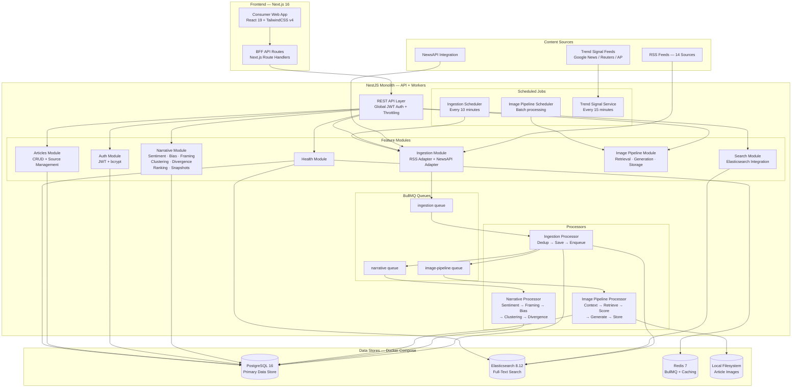

# FRACTURE — Technical System Design

**Classification:** Investor-Grade Architecture Document
**Version:** 2.0
**Date:** March 10, 2026
**Author:** CTO, Fracture Inc.

---

### Changelog (v1.0 → v2.0)

1. **Monolithic NestJS architecture replaces microservices topology.** The MVP is implemented as a single NestJS backend with modular service boundaries, not the distributed microservices architecture described in v1.0. All services run in one process; Kafka is replaced by BullMQ (Redis-backed job queues).
2. **Image Pipeline module added (Section 2.10).** A complete image sourcing, AI generation, relevance scoring, and storage pipeline not described in v1.0.
3. **Frontend application fully implemented.** Next.js 16 + React 19 consumer web app with homepage, story detail, comparison, and search/discovery pages — plus a Backend-for-Frontend (BFF) API layer.
4. **Auth is custom JWT, not Auth0.** Registration, login, refresh, and logout implemented with bcrypt + JWT in NestJS, not via Auth0/OpenID Connect.
5. **Story Ranking, Trend Signals, Narrative Snapshots, and Search Discovery services added.** Four new subsystems in the Narrative Intelligence layer not present in v1.0.
6. **14 seeded sources (not 200+).** MVP ships with 14 curated RSS sources spanning the U.S. political spectrum plus international wire services.
7. **Docker Compose local dev stack replaces Kubernetes/EKS.** Development infrastructure runs PostgreSQL 16, Redis 7, and Elasticsearch 8.12 in Docker containers.
8. **Clustering algorithm updated.** Topic-keyword + headline similarity + time proximity composite (threshold ≥ 0.45) replaces TF-IDF cosine similarity (≥ 0.65) from v1.0.
9. **Sentiment analysis is custom lexicon-based, not VADER + TextBlob.** A VADER-inspired service with a curated media-specific valence lexicon plus negation/amplifier heuristics.
10. **Mermaid architecture diagram and service topology table updated** to reflect actual implemented services and data flows.

---

## 1. EXECUTIVE TECHNICAL SUMMARY

*Updated v2 — Revised to reflect the implemented monolithic NestJS architecture, BullMQ event pipeline, and current source count. Core thesis and defensibility narrative unchanged.*

Fracture is a real-time narrative intelligence platform that ingests news content from curated sources across the political spectrum, clusters articles into unified story threads, and computes quantitative divergence metrics on how each outlet frames, structures, and linguistically shapes the same underlying event.

The system is built on three technical layers: a high-throughput ingestion pipeline (RSS feeds, NewsAPI integration), a narrative intelligence engine (deterministic scoring with rule-based algorithms), and a consumer-facing read-optimized API backed by application-level caching and pre-computed narrative clusters.

**Why this architecture supports venture-scale growth:**

The ingestion and intelligence layers are decoupled from the serving layer via BullMQ job queues backed by Redis. This means we can scale content processing independently from user-facing traffic. The modular NestJS architecture is designed for future decomposition into independent microservices — each module (Ingestion, Narrative, Search, Image Pipeline) has clean service boundaries and communicates via queue-based async processing. During breaking news spikes, the read path serves from pre-computed cluster data and cached responses — ingestion backpressure never degrades user experience.

**Defensibility:**

Fracture's moat is not the algorithm — it's the dataset. Every article ingested is enriched with framing metadata, bias coordinates, narrative cluster assignments, and temporal divergence scores. This proprietary annotation layer compounds daily. After 12 months of operation, Fracture will hold the largest structured narrative divergence dataset in existence. This dataset is the training corpus for our ML models and the product surface for enterprise licensing. It cannot be replicated without running the same pipeline for the same duration.

**AI integration path:**

The MVP ships with deterministic, rule-based scoring (lexical analysis, source-level bias priors, structural feature extraction). Every scored article becomes a labeled training example. By month 8–10, we have sufficient volume to fine-tune classification models for framing detection, sentiment polarity, and narrative clustering. By Year 2, we train proprietary embedding models that map articles into a narrative vector space where divergence is computed geometrically rather than heuristically. The Image Pipeline module already integrates OpenAI APIs for embedding-based image relevance scoring and DALL-E 3 image generation — establishing the AI integration pattern for future NLP model upgrades.

**National-level traffic resilience:**

The serving architecture is designed around the insight that narrative data is read-heavy and temporally bounded. Active story clusters are materialized with pre-computed divergence scores and ranking signals. The system is designed to scale horizontally behind a load balancer with auto-scaling policies tuned to CPU and queue depth. The architecture is designed to serve 1M+ DAU with p99 latency under 200ms on the read path once CDN and edge caching layers (planned) are deployed.

---

## 2. SYSTEM ARCHITECTURE

### 2.1 High-Level System Diagram

*Updated v2 — Replaced with actual implemented architecture: monolithic NestJS backend, BullMQ queues, Next.js frontend with BFF layer. Removed Kafka, Kong, and services not yet built.*



### 2.2 Service Topology

*Updated v2 — Replaced with actual implemented NestJS modules. All services run within a single NestJS process. Scaling model reflects monolith-first approach with future decomposition path.*

| Module | Responsibility | Implementation | Status |
|---|---|---|---|
| **Articles Module** | Article + Source CRUD, cluster lookup | TypeORM repositories, REST controllers | ✅ Implemented |
| **Ingestion Module** | Fetch from RSS/NewsAPI, dedup, enqueue processing | RSS Parser, Axios, BullMQ producer, Cron scheduler | ✅ Implemented |
| **Narrative Module** | Sentiment, bias, framing, clustering, divergence, ranking, snapshots, trends, discovery search | 12 service classes, BullMQ consumer | ✅ Implemented |
| **Search Module** | Full-text and faceted search, autocomplete | Elasticsearch client, custom analyzers | ✅ Implemented |
| **Auth Module** | User registration, JWT auth, role-based access | bcrypt, Passport JWT strategy, RBAC guards | ✅ Implemented |
| **Image Pipeline Module** | Article image sourcing, AI generation, relevance scoring, storage | Unsplash/Openverse APIs, OpenAI DALL-E 3, embedding similarity | ✅ Implemented |
| **Health Module** | Infrastructure health checks | PostgreSQL, Redis, Elasticsearch ping | ✅ Implemented |

**Future decomposition targets** (when traffic justifies the operational complexity):

| Module → Service | Trigger | Benefit |
|---|---|---|
| Ingestion → independent worker | > 50k articles/day | Independent scaling of fetch + dedup workers |
| Narrative → GPU-enabled service | ML model deployment | GPU node group for transformer inference |
| Image Pipeline → independent worker | > 100 images/hour | Isolate expensive AI API calls |
| Search → dedicated cluster | > 500 queries/sec | Elasticsearch-specific scaling |

### 2.3 Data Ingestion Architecture

*Updated v2 — Reflects actual BullMQ-based pipeline with 14 RSS sources, 10-minute scheduler, and integrated image pipeline handoff.*

```
Source → RSS/NewsAPI Adapter → Ingestion Service → BullMQ (ingestion queue)
  → Ingestion Processor:
      1. Filter stale articles (> 30 days old)
      2. Dedup (URL canonical + headline match + SimHash)
      3. Image validation + upgrade
      4. Save to PostgreSQL
      5. Bulk index to Elasticsearch
      6. Enqueue to narrative queue
      7. Enqueue to image-pipeline queue (if no valid image)
  → Narrative Processor:
      1. Sentiment analysis
      2. Framing detection + structural features
      3. Bias scoring (composite)
      4. Story clustering
      5. Per-article divergence
      6. Cluster divergence update
```

**Ingestion throughput:** Currently processing 14 RSS sources on a 10-minute cron cycle. Each cycle fetches new articles from all active sources concurrently. Designed to scale to 50,000 articles/day at MVP, 500,000+/day with worker decomposition.

**Source management:**
- 14 sources seeded on application bootstrap via `SourceSeederService`.
- Each source has a dedicated RSS feed URL, political lean prior, establishment prior, reliability score, country, region, and fetch interval.
- Sources are weighted by editorial reliability tier (not bias — reliability).
- Source tiers: `TIER_1_BREAKING` (1 min), `TIER_1_STANDARD` (5 min), `TIER_2` (15 min), `TIER_3` (60 min). All 14 current sources are `TIER_1_STANDARD`.
- Source upsert on boot ensures feed URL fixes propagate without manual DB intervention.

**Current source roster (14 outlets):**

| Source | Lean Prior | Establishment | Reliability | Country |
|---|---|---|---|---|
| BBC News | 0.0 | 0.6 | 0.85 | GB |
| CNN | -0.3 | 0.5 | 0.70 | US |
| Fox News | +0.6 | 0.4 | 0.55 | US |
| NPR | -0.1 | 0.6 | 0.85 | US |
| Associated Press | 0.0 | 0.7 | 0.90 | US |
| The Guardian | -0.4 | 0.5 | 0.80 | GB |
| Washington Post | -0.2 | 0.6 | 0.80 | US |
| Reuters | 0.0 | 0.7 | 0.92 | GB |
| Politico | -0.2 | 0.6 | 0.78 | US |
| Axios | -0.1 | 0.5 | 0.80 | US |
| The Hill | +0.1 | 0.5 | 0.75 | US |
| HuffPost | -0.6 | 0.3 | 0.60 | US |
| National Review | +0.7 | 0.5 | 0.65 | US |
| The Federalist | +0.8 | 0.3 | 0.55 | US |

**Deduplication (3-stage, as designed in v1.0):**
- Stage 1: URL canonicalization (strip UTM params, fbclid, gclid, normalize www prefix, trailing slashes).
- Stage 2: Exact headline match within 24-hour window.
- Stage 3: SimHash (FNV-1a 64-bit) on article body with Hamming distance threshold ≤ 3.

### 2.4 Event-Driven Pipeline

*Updated v2 — ~~Apache Kafka~~ → Replaced by BullMQ (Redis-backed job queues). Simpler operational model appropriate for MVP scale. Kafka remains on the roadmap for growth-stage decomposition.*

BullMQ is the async processing backbone. All inter-module async communication flows through Redis-backed job queues.

**BullMQ Queues:**

| Queue | Job Types | Retry Policy | Consumers |
|---|---|---|---|
| `ingestion` | `process-articles` (batch) | 3 attempts, exponential backoff (2s base) | Ingestion Processor |
| `narrative` | `analyse-article` (single) | 3 attempts, exponential backoff (2s base) | Narrative Processor |
| `image-pipeline` | `single`, `batch`, `cluster` | 2 attempts, exponential backoff (10s base) | Image Pipeline Processor |

**Why BullMQ over Kafka at MVP:**
- Single Redis dependency (already required for caching and rate limiting).
- Zero operational overhead vs. managing a Kafka cluster.
- Built-in retry, backoff, delayed jobs, and priority queues.
- Job-level visibility via BullMQ dashboard.
- Sufficient for MVP throughput (< 50k articles/day).

**Migration path to Kafka:**
- Each BullMQ queue maps to a future Kafka topic.
- Processor classes are already isolated — swapping the transport layer requires changing only the queue producer/consumer wiring, not business logic.
- Trigger: when message throughput exceeds Redis single-node capacity or when replay/reprocessing capability becomes critical for model retraining.

### 2.5 Narrative Intelligence Layer

Detailed in Section 4. In the architecture context:

*Updated v2 — Reflects actual service composition: 12 services within a single NestJS module, not separate microservices.*

- All narrative intelligence runs as services within the `NarrativeModule`.
- BullMQ `narrative` queue feeds the `NarrativeProcessor` which orchestrates the full pipeline per article.
- Pipeline order: Sentiment → Framing → Bias → Clustering → Divergence.
- Results written to PostgreSQL (structured metadata on the `Article` and `StoryCluster` entities).
- Cluster-level divergence scores (FDI) and ranking signals updated after each article assignment.
- No embedding storage yet (pgvector planned for v2 ML transition).

**Services in the Narrative Module:**

| Service | Responsibility |
|---|---|
| `SentimentService` | Lexicon-based VADER-inspired sentiment scoring |
| `BiasScoringService` | 5-component composite bias scoring |
| `FramingDetectorService` | Framing type + structural feature extraction |
| `ClusteringService` | Topic-keyword + headline similarity clustering |
| `DivergenceService` | Fracture Divergence Index (FDI) computation |
| `TopicExtractionService` | Keyword and named entity extraction |
| `TopicClassifierService` | Cluster topic category classification |
| `StoryRankingService` | Hero story selection + velocity metrics |
| `TrendSignalService` | External trend ingestion (Google News, Reuters, AP) |
| `TrendingService` | Trending cluster computation |
| `SnapshotService` | Left-frame / right-frame narrative snapshot generation |
| `SearchDiscoveryService` | PostgreSQL-based cluster + article discovery search |

### 2.6 Search + Indexing Layer

*Updated v2 — Reflects actual single-node Elasticsearch 8.12 deployment with implemented index mappings and search capabilities.*

**Elasticsearch configuration:**
- Single-node development deployment (Elasticsearch 8.12 via Docker).
- Index: `fracture-articles` with custom headline autocomplete analyzer (edge n-gram, min 2 / max 20).
- Security disabled for local development (`xpack.security.enabled=false`).

**Index mappings (implemented):**

| Field | ES Type | Purpose |
|---|---|---|
| `title` | text + autocomplete + keyword | Full-text search, autocomplete, exact match |
| `summary` | text | Full-text search |
| `content` | text (first 5000 chars) | Full-text search |
| `politicalLeanScore` | float | Bias range filtering |
| `framingType` | keyword | Faceted filtering |
| `sourceSlug` | keyword | Source filtering |
| `storyClusterId` | keyword | Cluster filtering |
| `publishedAt` | date | Time range filtering |

**Search capabilities (implemented):**
- Full-text search across headlines, summaries, and content with field boosting (title 3×, summary 2×).
- Faceted filtering by source, bias score range, story cluster, framing type, and time window.
- Autocomplete via edge n-gram tokenizer on headline corpus.
- Fuzzy matching (`fuzziness: AUTO`).
- Bulk indexing of articles on ingestion completion.

> ⚠️ Needs verification: Production Elasticsearch cluster sizing (3 master + 6 data nodes per v1.0) has not been implemented. Current deployment is single-node dev mode.

### 2.7 Edge + CDN Strategy

> ⚠️ Needs verification: Cloudflare CDN, Edge KV Cache, WAF, and Workers have not been implemented in the current codebase. The strategy below is retained from v1.0 as the planned production configuration.

**Cloudflare configuration (planned):**
- All API responses for story feeds: 60s edge TTL, stale-while-revalidate for 300s.
- Story cluster pages: 30s edge TTL during breaking news, 300s steady-state.
- Static assets (JS, CSS, images): immutable, 1-year TTL, content-hashed filenames.
- Cloudflare Workers for A/B testing, geographic feed customization, and request coalescing.

**Cache invalidation (planned):**
- Event-driven: cluster update events trigger selective purge via Cloudflare API.
- TTL-based: Natural expiry handles the majority case.
- Emergency: Manual purge capability via internal admin API.

**Request coalescing (planned):**
- During traffic spikes, Cloudflare Workers coalesce identical origin requests.
- 100 simultaneous requests for the same story cluster result in 1 origin fetch.

### 2.8 Failover Design

> ⚠️ Needs verification: Multi-AZ, read replicas, Redis cluster, and Kafka failover have not been implemented. Current deployment is single-node Docker Compose for all data stores. The strategy below is retained from v1.0 as the planned production configuration.

**Database (planned):**
- PostgreSQL: RDS Multi-AZ with synchronous replication. Read replicas in each AZ.
- Redis: 6-node cluster (3 primary, 3 replica) across 3 AZs.
- Elasticsearch: Rack-aware allocation across 3 AZs, 1 replica per shard.

**Application (planned):**
- All services run minimum 3 replicas across 3 AZs.
- Kubernetes pod disruption budgets: maxUnavailable = 1.
- Circuit breakers (Hystrix pattern) on all inter-service calls.
- Graceful degradation: if NLP pipeline is down, serve cached scores; flag staleness.

**Current (development):**
- Single PostgreSQL instance with TypeORM `synchronize: true`.
- Single Redis instance for BullMQ and caching.
- Single Elasticsearch node.
- Health module checks all three services and reports `ok` / `degraded` status.

### 2.9 Multi-Region Strategy

**Phase 1 (Year 1–2):** Single region (us-east-1), multi-AZ.
**Phase 2 (Year 2–3):** Active-passive with us-west-2 as warm standby.
**Phase 3 (Year 3+):** Active-active with regional ingestion pipelines.

Multi-region data synchronization:
- PostgreSQL: AWS DMS for cross-region replication.
- Elasticsearch: Cross-cluster replication (CCR) for search indices.
- ~~Kafka: MirrorMaker 2 for topic replication.~~ → BullMQ queues are regional; cross-region sync at the database level.
- Redis: Application-level cache warming (no cross-region replication — cache miss falls through to regional DB replica).

**International expansion strategy:**
- EU region (eu-west-1) for GDPR-compliant user data residency.
- Ingestion pipeline per region for local-language sources.
- Narrative intelligence models remain centralized, serve via API.

### 2.10 Image Pipeline

*New section in v2 — This subsystem was not described in v1.0.*

The Image Pipeline is a complete subsystem for sourcing, generating, scoring, and storing representative images for articles and story clusters.

**Pipeline stages:**

```
Article/Cluster → Image Context Service (extract keywords + topic)
  → Image Retrieval Service (Unsplash + Openverse search)
  → Image Relevance Service (OpenAI embedding cosine similarity)
  → Image Generation Service (DALL-E 3 fallback for low-relevance results)
  → Image Storage Service (local filesystem or S3-compatible)
  → Update Article/Cluster imageUrl
```

**Services:**

| Service | Responsibility |
|---|---|
| `ImageContextService` | Extract search keywords and topic context from article/cluster content |
| `ImageRetrievalService` | Search Unsplash and Openverse for candidate images |
| `ImageRelevanceService` | Score candidate images using OpenAI text-embedding-3-small cosine similarity |
| `ImageGenerationService` | Generate editorial images via OpenAI DALL-E 3 when no relevant stock image found |
| `ImageStorageService` | Store images locally or to S3-compatible storage; serve via static file middleware |
| `ImagePipelineService` | Orchestrate the full pipeline; batch processing for clusters missing images |

**Configuration:**
- Similarity threshold: 0.75 default, with per-category overrides (politics: 0.80, economy: 0.75, technology: 0.72).
- Minimum cluster articles for image processing: 3.
- Storage: local filesystem in development (`uploads/article-images/`), S3-compatible in production.
- Scheduler: batch processes clusters without images on a cron schedule.

### 2.11 Frontend Architecture

*New section in v2 — The consumer web application was not detailed in v1.0.*

**Tech stack:**
- Next.js 16 (App Router) with React 19
- TailwindCSS v4 with custom editorial design system
- TanStack React Query v5 (60s staleTime for data freshness)
- Zustand for client-side state (feed perspective/sort preferences)
- Framer Motion for animations
- Lucide React for icons

**Pages:**

| Route | Purpose |
|---|---|
| `/` | Homepage: hero story, trending sidebar, fractured story, latest feed |
| `/story/[clusterId]` | Story detail: divergence breakdown, source spectrum, narrative frames, headline comparison, timeline |
| `/compare` | Side-by-side article comparison with newspaper-column layout and divergence gutter |
| `/search` | Discovery search: query input, trending topics, ranked cluster + article results |

**Backend-for-Frontend (BFF) layer:**

Next.js API route handlers (`/api/*`) proxy requests to the NestJS backend and transform responses for frontend consumption:

| BFF Route | Backend Endpoint | Transform |
|---|---|---|
| `GET /api/homepage` | `GET /api/v1/narrative/homepage` | Enrich clusters with divergence + spectrum data |
| `GET /api/stories` | `GET /api/v1/narrative/stories` | Paginate + format |
| `GET /api/stories/[id]` | `GET /api/v1/narrative/clusters/[id]` | Full cluster detail with articles + narrative data |
| `GET /api/stories/[id]/snapshot` | `GET /api/v1/narrative/clusters/[id]/snapshot` | Narrative snapshot for sharing |
| `GET /api/search` | `GET /api/v1/narrative/discover` | Discovery search results |
| `GET /api/stats` | `GET /api/v1/narrative/feed-stats` | Feed statistics |

**Key frontend components:**
- `HeroWithSidebar` — full-width hero story with trending sidebar
- `FracturedSection` — most divergently-covered story spotlight
- `SourceSpectrum` — horizontal political lean visualization
- `NarrativeFrames` — how different frames cover the same story
- `DivergenceBreakdown` — FDI sub-metric visualization
- `HeadlineComparison` — side-by-side headline display sorted by lean
- `NarrativeTimeline` — chronological article timeline
- `BiasIndicator` — political lean badge component
- `FractureMeter` — divergence score gauge

---

## 3. DATA MOAT STRATEGY

### 3.1 Proprietary Narrative Dataset Construction

*Updated v2 — Schema reflects actual TypeORM entity fields. ~~narrative_embedding: vector[768]~~ not yet implemented (pgvector planned for ML transition). Fields marked with ✅ are implemented; fields marked with 🔮 are planned.*

Every article that enters Fracture is annotated with a structured metadata envelope that does not exist anywhere else:

```
Article Entity (PostgreSQL — articles table) {
  id: UUID                                    ✅
  sourceId: UUID                              ✅
  storyClusterId: UUID                        ✅
  ingestedAt: timestamp                       ✅
  publishedAt: timestamp                      ✅

  // Bias coordinates
  politicalLeanScore: float [-1.0, 1.0]       ✅  // left-right axis
  establishmentScore: float [-1.0, 1.0]       ✅  // establishment-outsider axis

  // Framing metadata
  framingType: enum [CONFLICT, HUMAN_INTEREST, ECONOMIC, MORAL, RESPONSIBILITY]  ✅
  framingConfidence: float                    ✅

  // Linguistic features
  headlineSentiment: float [-1.0, 1.0]        ✅
  bodySentiment: float [-1.0, 1.0]            ✅
  headlineBodySentimentGap: float              ✅  // clickbait indicator
  emotionalValence: float                     ✅
  certaintyLanguageScore: float               ✅
  attributionDensity: float                   ✅  // quotes per paragraph
  passiveVoiceRatio: float                    ✅

  // Structural features
  ledeType: enum [SUMMARY, ANECDOTAL, SCENIC, QUESTION]  ✅
  sourceCount: int                            ✅
  namedSourceRatio: float                     ✅
  paragraphCount: int                         ✅
  quoteToNarrativeRatio: float                ✅

  // Narrative position
  clusterCentroidDistance: float               ✅
  divergenceFromMedian: float                 ✅
  narrativeShiftDelta: float                  ✅  // vs. same outlet's prior coverage
  firstInCluster: bool                        ✅

  // Deduplication
  simhash: bigint                             ✅

  // Media
  imageUrl: string                            ✅

  // Planned (not yet implemented)
  dominant_frame_entities: Entity[]            🔮
  narrative_embedding: vector[768]             🔮  // requires pgvector
  time_since_cluster_origin: duration          🔮  // computed at query time
}
```

```
StoryCluster Entity (PostgreSQL — story_clusters table) {
  id: UUID                                    ✅
  topic: text                                 ✅
  summary: text                               ✅
  topicKeywords: jsonb                        ✅
  status: enum [BREAKING, ACTIVE, ARCHIVED]   ✅
  articleCount: int                           ✅
  sourceCount: int                            ✅
  divergenceScore: float [0–100]              ✅  // cached FDI
  velocityScore: float                        ✅  // articles per hour
  isFractured: bool                           ✅  // divergenceScore ≥ 40 && sourceCount ≥ 2
  topicCategory: string                       ✅  // politics, world, economy, etc.
  imageUrl: text                              ✅
  newestArticleAt: timestamp                  ✅
  oldestArticleAt: timestamp                  ✅
}
```

```
Source Entity (PostgreSQL — sources table) {
  id: UUID                                    ✅
  name: string                                ✅
  slug: string (unique)                       ✅
  url: string                                 ✅
  rssFeedUrl: string                          ✅
  tier: enum [TIER_1_BREAKING, TIER_1_STANDARD, TIER_2, TIER_3]  ✅
  politicalLeanPrior: float [-1.0, 1.0]       ✅
  establishmentPrior: float [-1.0, 1.0]       ✅
  reliabilityScore: float [0.0–1.0]           ✅
  country: string (ISO 3166-1 alpha-2)        ✅
  region: string                              ✅
  isActive: bool                              ✅
  fetchIntervalSeconds: int                   ✅
}
```

```
TrendSignal Entity (PostgreSQL — trend_signals table) {
  id: UUID                                    ✅
  keyword: text                               ✅
  source: string                              ✅  // 'google_news', 'reuters', 'ap_news'
  trendScore: float [0–100]                   ✅
  detectedAt: timestamp                       ✅
}
```

```
User Entity (PostgreSQL — users table) {
  id: UUID                                    ✅
  email: string (unique)                      ✅
  passwordHash: string                        ✅
  displayName: string                         ✅
  role: enum [free, pro, analyst, enterprise, admin]  ✅
  isActive: bool                              ✅
  refreshTokenHash: string                    ✅
}
```

This metadata envelope is generated for every article. At scale with 50k articles/day, Fracture produces **18M+ annotated records per year**. No public dataset contains this structure. No competitor can backfill it.

### 3.2 Story Clustering Evolution

*Updated v2 — MVP clustering algorithm updated to reflect actual implementation (topic-keyword + headline similarity + time proximity) rather than the planned TF-IDF cosine approach.*

**MVP (Implemented — Rule-based composite scoring):**
- Topic keyword extraction: significant terms from headlines, multi-word named entities, single proper nouns, acronyms, titled names (up to 40 keywords per article).
- Composite scoring with three signals:
  - **Topic keyword overlap (40%):** Jaccard-like coefficient between article keywords and cluster keyword set.
  - **Headline word overlap (35%):** Significant term overlap between article title and cluster topic.
  - **Time proximity (25%):** Decay function: ≤24h → 1.0, ≤72h → 0.85, ≤7d → 0.65, ≤14d → 0.40, >14d → reject.
- Composite threshold: ≥ 0.45 for cluster assignment.
- Topical gate: minimum topical score (keyword + headline combined) ≥ 0.15 to prevent time-proximity-only matches.
- Cluster lifecycle: BREAKING (< 24h) → ACTIVE (< 14d) → ARCHIVED (> 14d).
- Maximum 100 candidate clusters evaluated per article (performance cap).
- Keyword merging: new article keywords are merged into existing cluster keyword sets.

~~TF-IDF vectors on headline + first 3 paragraphs with cosine similarity threshold ≥ 0.65~~ → Replaced by composite scoring approach described above. The composite approach better handles the news domain where headline overlap and named entity matching are stronger signals than raw TF-IDF cosine for story grouping.

**v2 (Learned):**
- Fine-tuned sentence-transformer model trained on Fracture's own cluster assignments (human-validated).
- Embedding-based clustering with HDBSCAN for dynamic cluster count.
- Hierarchical clustering: macro-narrative → story → sub-story.

**v3 (Narrative Graphs):**
- Story clusters become nodes in a directed narrative graph.
- Edges represent narrative evolution, spin-offs, and counter-narratives.
- Enables "narrative lineage" — tracing how a story mutates across outlets and time.

### 3.3 Framing Divergence Models

Framing divergence is computed per story cluster:

```
DivergenceIndex(cluster) = {
  headline_sentiment_spread: std_dev(headline_sentiments)
  framing_type_entropy: shannon_entropy(framing_type_distribution)
  entity_prominence_divergence: std_dev(political_lean_scores)   // bias spread proxy
  source_attribution_variance: std_dev(attribution_densities)
  linguistic_distance: std_dev(body_sentiments)                  // embedding proxy
  structural_divergence: std_dev(quote_ratio + passive_voice)
  overall_divergence: weighted_composite(above)
}
```

The **Divergence Index** is Fracture's signature metric. It quantifies, on a 0–100 scale, how differently the media ecosystem is covering a single story. High-divergence stories are the most editorially interesting and the most commercially valuable for enterprise customers.

*Updated v2 — The "entity_prominence_divergence" component uses political bias score spread as a proxy for Jensen-Shannon divergence on entity mention distributions. The "linguistic_distance" component uses body sentiment variance as a proxy for pairwise embedding cosine distance. Both will be upgraded to true embedding-based metrics in the ML transition phase.*

### 3.4 Defensibility Analysis

| Asset | Time to Replicate | Difficulty |
|---|---|---|
| Annotated narrative dataset (18M+ records/yr) | 12–18 months minimum | High — requires running equivalent pipeline |
| Story cluster history with temporal evolution | Cannot be backfilled | Extreme — temporal data is gone |
| Outlet-specific framing fingerprints | 6–12 months | High — requires same source coverage |
| Divergence index calibration | 12+ months | High — requires human validation at scale |
| Narrative embedding model (fine-tuned) | 6+ months after data exists | Medium — but data dependency is hard |
| User engagement data on narrative features | Cannot be replicated | Extreme — unique to Fracture's UX |

### 3.5 Network Effects

- **Supply side:** More sources → better cluster coverage → higher divergence signal fidelity → more valuable to users.
- **Demand side:** More users → more engagement data → better personalization → better narrative salience detection.
- **Enterprise data flywheel:** Enterprise customers request specific narrative domains → Fracture expands coverage → improves consumer product → attracts more enterprise demand.
- **Researcher contributions:** Academic partnerships generate published validations of Fracture's methodology → credibility moat.

---

## 4. NARRATIVE INTELLIGENCE ENGINE

### 4.1 Bias Scoring Model

*Updated v2 — Formula and weights match v1.0 exactly. Implementation confirmed in `BiasScoringService`. Added detail on actual entity lists and source selection detection.*

**MVP: Deterministic Composite Score (Implemented)**

Bias is computed on two axes (political lean + establishment alignment) using a weighted composite:

```
PoliticalLean(article) =
  0.40 × source_prior(outlet)           // AllSides/MBFC baseline
+ 0.20 × keyword_lean(article)          // politically-loaded term frequency
+ 0.15 × entity_sentiment(article)      // sentiment toward political entities
+ 0.15 × framing_lean(article)          // frame type correlation with lean
+ 0.10 × source_selection_lean(article) // who they quote, who they don't

EstablishmentScore(article) =
  0.50 × source_establishment_prior
+ 0.20 × establishment_linguistic_markers
+ 0.15 × attribution_density
+ 0.15 × named_source_ratio
```

**Source priors** are initialized from AllSides, Media Bias/Fact Check, and Ad Fontes Media baselines, stored on the `Source` entity as `politicalLeanPrior` and `establishmentPrior`. These serve as Bayesian priors that get overwhelmed by article-level evidence.

**Keyword lean scoring (implemented):**
- Curated lexicon of 40+ politically-loaded phrases with lean and weight assignments.
- Example: "undocumented immigrants" (lean: -0.3, weight: 0.7) vs. "illegal aliens" (lean: +0.6, weight: 0.8).
- Phrases searched longest-first to ensure multi-word phrases match before single words.
- Position boost: terms in first 200 characters (headline area) get 2× weighting.

**Entity sentiment lean (implemented):**
- 13 left-associated entities (democrat, democrats, democratic party, liberal, progressive, biden, harris, obama, pelosi, aoc, sanders, warren, left-wing).
- 11 right-associated entities (republican, republicans, gop, conservative, right-wing, trump, desantis, mcconnell, cruz, greene, gaetz).
- ±60 character window around entity mentions scored for sentiment.
- Net lean: (avg right sentiment − avg left sentiment) × 0.5.

**Source selection lean (implemented):**
- 9 left-associated organizations (Center for American Progress, Brookings, ACLU, etc.).
- 10 right-associated organizations (Heritage Foundation, Cato, Federalist Society, NRA, etc.).
- Score: (right hits − left hits) / total hits.

**Framing lean correlation (implemented):**
- CONFLICT → +0.15, HUMAN_INTEREST → -0.15, ECONOMIC → +0.10, MORAL → -0.10, RESPONSIBILITY → 0.

**v2: ML Upgrade Path**

After accumulating ~5M scored articles with human spot-check validations:
- Train a multi-task classifier on (political_lean, establishment_score) using a fine-tuned RoBERTa base.
- Input: headline + first 500 tokens of body.
- Auxiliary tasks: framing type classification, sentiment regression.
- Multi-task learning improves generalization and reduces labeling cost.
- Deterministic score becomes a feature input, not the final output.
- Model confidence score determines whether to defer to human review.

### 4.2 Framing Divergence Index

*Updated v2 — Weights match v1.0 exactly. Implementation confirmed in `DivergenceService`. Added detail on normalization ranges and the "fractured" threshold.*

The Fracture Divergence Index (FDI) is a per-cluster score from 0 to 100:

```
FDI(cluster) =
  25 × normalized(headline_sentiment_spread)     // σ of headline sentiments, norm [0, 1.0]
+ 20 × normalized(framing_type_entropy)          // Shannon entropy, norm [0, log₂(5)]
+ 20 × normalized(bias_spread)                   // σ of political lean scores, norm [0, 1.0]
+ 15 × normalized(linguistic_spread)             // σ of body sentiments (embedding proxy), norm [0, 1.0]
+ 10 × normalized(source_selection_variance)     // σ of attribution densities, norm [0, 0.5]
+ 10 × normalized(structural_divergence)         // σ of (quote_ratio + passive_voice), norm [0, 0.5]
```

Clusters require ≥ 2 articles for meaningful FDI computation. Single-article clusters return FDI = 0.

**"Fractured" threshold:** A cluster is marked `isFractured = true` when FDI ≥ 40 AND sourceCount ≥ 2. This flag drives the "Most Fractured" section on the homepage.

All six sub-metrics are returned on a 0–100 scale for frontend visualization in the `DivergenceBreakdown` component.

### 4.3 Headline Sentiment Differential

*Updated v2 — Implementation is custom lexicon-based, not VADER + TextBlob as planned in v1.0.*

Each article computes `headlineBodySentimentGap = |sentiment(headline) - sentiment(body)|`.

Aggregated per cluster, this reveals:
- Which outlets are editorializing in headlines while reporting neutrally in body text.
- Which outlets use emotional headlines as a consistent pattern.
- Temporal trends in headline sensationalism per outlet.

**Implementation:**
- ~~MVP: VADER sentiment + TextBlob subjectivity as dual-signal.~~ → Replaced by custom VADER-inspired lexicon-based sentiment service.
- 100+ curated valence entries covering strongly positive (+0.85: "excellent", "outstanding") to strongly negative (-0.8: "horrific") with media-specific terms.
- Negation detection: 7 negation words ("not", "no", "never", "neither", "nobody", "nothing", "nowhere") flip valence sign.
- Amplifier detection: 6 amplifier words ("very", "extremely", "incredibly", "absolutely", "completely", "totally") boost magnitude by 1.3×.
- Diminisher detection: 4 diminisher words ("slightly", "somewhat", "barely", "hardly") reduce magnitude by 0.7×.
- Emotional valence computed separately from sentiment for the emotionalValence field.
- v2: Fine-tuned DistilBERT sentiment classifier on news headline corpus (SemEval + custom labels).

### 4.4 Structural Framing Detection

*Updated v2 — All features implemented in `FramingDetectorService`. Detection methods confirmed.*

Beyond lexical analysis, Fracture detects structural framing patterns:

| Feature | What It Reveals | Detection Method | Status |
|---|---|---|---|
| Framing type | CONFLICT, HUMAN_INTEREST, ECONOMIC, MORAL, RESPONSIBILITY | Keyword pattern matching with confidence scoring | ✅ |
| Lede structure | What the outlet considers most important | Rule-based first-paragraph classification (SUMMARY, ANECDOTAL, SCENIC, QUESTION) | ✅ |
| Quote placement | Who gets voice, and when | Regex quotation extraction + paragraph position | ✅ |
| Paragraph structure | Narrative arc choices | Paragraph count computation | ✅ |
| Attribution patterns | Transparency of sourcing | Quote-to-narrative ratio, named source ratio, attribution density | ✅ |
| Passive voice ratio | Responsibility framing | Regex-based passive construction detection | ✅ |
| Certainty language | Confidence in claims | Certainty marker lexicon scanning | ✅ |
| Entity ordering | Prominence hierarchy | Named entity position tracking | 🔮 Planned |
| What's omitted | Stories covered elsewhere but absent here | Cluster coverage gap analysis | 🔮 Planned |

**Omission detection** is uniquely valuable: when a major outlet does not cover a story that 15+ other outlets are covering, that absence is itself a framing signal. Fracture is architecturally positioned to detect this at scale — the cluster + source data model enables this analysis once source coverage reaches sufficient breadth.

### 4.5 Keyword Salience Weighting

*Updated v2 — Implemented with position boost. TF-IDF weighting is simplified to a curated weight system in the current lexicon.*

Not all terms carry equal framing weight. Fracture computes per-term salience:

```
Salience(term, article) = lean × weight × PositionBoost
```

- **weight:** Curated weight per phrase reflecting framing signal strength (0.3–1.0 range).
- **PositionBoost:** Terms in first 200 characters (headline area) get 2×, body gets 1×.
- **Cluster-relative salience:** Terms that appear in some cluster articles but not others are high-signal for divergence (implemented via FDI bias spread and framing entropy components).

### 4.6 Narrative Shift Tracking

For each outlet, Fracture tracks how coverage of a story evolves over time:

*Updated v2 — Implemented in `DivergenceService.computeArticleDivergence()` using politicalLeanScore delta rather than embedding cosine distance.*

```
NarrativeShift(outlet, cluster, t) =
  |politicalLeanScore(outlet, cluster, t) - politicalLeanScore(outlet, cluster, t-1)|
```

This reveals:
- Which outlets shift narrative framing as stories develop.
- Whether shifts correlate with political events.
- Whether outlets converge or diverge over a story's lifecycle.

~~Stored in TimescaleDB as time-series data~~ → Stored on the `Article` entity as `narrativeShiftDelta`, queryable via PostgreSQL. TimescaleDB planned for growth stage when time-series query volume justifies the operational complexity.

### 4.7 Data Labeling Strategy

| Phase | Method | Volume | Purpose |
|---|---|---|---|
| Pre-launch | Founding team + contractors label 5k articles | 5,000 | Calibrate deterministic model |
| Months 1–6 | Crowd-sourced via Surge AI with 3× redundancy | 50,000 | Validate and tune scoring |
| Months 6–12 | Active learning: model flags low-confidence, humans label | 100,000 | Targeted improvement |
| Year 2+ | Continuous labeling pipeline, 500/day | 180,000/yr | Model retraining, drift detection |

Label taxonomy: political lean (5-point scale), framing type (5 categories), sentiment (continuous), factual density (3-point scale).

Inter-annotator agreement tracked via Krippendorff's alpha. Minimum threshold: α ≥ 0.67 for all categories.

### 4.8 Human-in-the-Loop Moderation

- **Editorial review queue:** Articles with model confidence < 0.6 are flagged for human review.
- **Methodology council:** Quarterly review of scoring methodology by a 5-person advisory panel (journalists, political scientists, NLP researchers).
- **Public methodology page:** Scoring methodology is documented publicly. This is a feature, not a liability — it builds trust and differentiates from black-box alternatives.
- **Dispute mechanism:** Outlets can flag scores they believe are inaccurate. Disputes trigger human review and, if valid, feed back into model training.

### 4.9 Enterprise Analytics Architecture

Enterprise customers access a superset of consumer narrative data:

- **Narrative dashboards:** Real-time divergence monitoring for tracked topics.
- **Custom alert rules:** "Notify when FDI for [topic] exceeds 70."
- **Historical analysis:** Query narrative trends over arbitrary time windows.
- **Export API:** Bulk export of narrative metadata for integration with internal analytics.
- **Benchmark reports:** How coverage of [client's industry] diverges across outlets.

Enterprise data is served from the same pipeline but with higher-resolution access (per-article metadata vs. cluster-level summaries for consumers) and longer retention windows.

### 4.10 Story Ranking Engine

*New section in v2 — Not described in v1.0.*

The `StoryRankingService` powers the homepage by selecting and ranking story clusters for hero placement, trending sidebar, and "most fractured" spotlight.

**Hero story selection algorithm:**

```
heroScore(cluster) =
  articleCountNorm × 0.20          // normalized against cap of 30
+ sourceDiversityNorm × 0.25      // normalized against cap of 10
+ recencyNorm × 0.20              // exponential decay, halflife = 6 hours
+ divergenceNorm × 0.20           // FDI / 100
+ velocityScore × 0.10            // articles-per-hour normalized
+ trendBoost × 0.05               // match against external trend signals
```

**Strict hero filters:**
- Minimum 3 articles in cluster.
- Minimum 2 distinct sources.
- Newest article within 12 hours.
- Must be in a hero-eligible topic category (politics, world, economy, conflict, elections, policy, geopolitics).
- Low-quality headline patterns filtered out ("video shows", "viral video", "you won't believe", etc.).

**Fallback logic:** If no clusters pass strict hero filters, relaxed filters apply (48-hour recency window, all topic categories eligible).

**Velocity metrics:**
- `articleVelocity`: articles per hour since cluster creation.
- `sourceVelocity`: distinct sources per hour.
- `divergenceSpike`: rate of FDI increase.
- `isBreaking`: true if velocity exceeds threshold of 5 articles/hour.

### 4.11 Trend Signal Ingestion

*New section in v2 — Not described in v1.0.*

The `TrendSignalService` ingests trending topics from external RSS feeds to boost story ranking for clusters matching real-world trending events.

**Trend sources:**
- Google News (politics RSS)
- Reuters (world RSS)
- AP News (politics RSS)

**Refresh schedule:** Every 15 minutes via `@Cron` scheduler + on application startup.

**Trend matching:** Extracted keywords from trend feed headlines are stored in the `trend_signals` table. The story ranking algorithm checks cluster topic keywords against recent trend signals and applies a boost to the hero score for matching clusters.

### 4.12 Narrative Snapshots

*New section in v2 — Not described in v1.0.*

The `SnapshotService` generates shareable narrative snapshots — compact summaries of how different outlets frame the same story, optimized for social media virality.

**Snapshot structure:**
```json
{
  "headline": "Cluster topic title",
  "leftFrame": {
    "summary": "How left-leaning outlets frame this story",
    "sources": ["CNN", "The Guardian", "HuffPost"],
    "sentiment": -0.3
  },
  "rightFrame": {
    "summary": "How right-leaning outlets frame this story",
    "sources": ["Fox News", "National Review"],
    "sentiment": 0.2
  },
  "divergenceScore": 67.5,
  "articleCount": 12,
  "sourceCount": 8,
  "generatedAt": "2026-03-10T12:00:00Z"
}
```

**Algorithm:**
1. Load all articles with sources for the cluster.
2. Split by politicalLeanScore: left (< 0) vs. right (≥ 0).
3. Pick most extreme article from each side.
4. Extract framing summary from headline + summary.
5. Collect source names for each side.

---

## 5. SCALABILITY MODEL

### 5.1 Traffic Modeling Assumptions

| Metric | MVP (Month 1–6) | Growth (Month 6–18) | Scale (Month 18+) |
|---|---|---|---|
| DAU | 10,000 | 250,000 | 1,000,000+ |
| Peak concurrent users | 2,000 | 50,000 | 200,000 |
| API requests/sec (steady) | 200 | 5,000 | 20,000 |
| API requests/sec (spike) | 1,000 | 25,000 | 100,000 |
| Articles ingested/day | 50,000 | 200,000 | 500,000 |
| Story clusters active | 2,000 | 10,000 | 50,000 |
| Search queries/sec | 20 | 500 | 2,000 |

**Breaking news multiplier:** 5–10× sustained for 2–4 hours. Architecture must handle 10× burst without degradation.

### 5.2 Caching Strategy

*Updated v2 — Layer 1 (Edge) is planned, not implemented. Layer 2 (Redis) is partially implemented via BullMQ. Layer 3 (PostgreSQL) is implemented.*

**Layer 1: Edge Cache (Planned — Cloudflare)**
- Story feed responses: 60s TTL, stale-while-revalidate 300s.
- Individual story cluster responses: 30s TTL during breaking, 300s steady-state.
- Cache hit target: 85%+ of all read requests never reach origin.
- Geographic distribution: 300+ Cloudflare PoPs worldwide.

**Layer 2: Application Cache (Redis — Partial)**
- BullMQ job queue management (implemented).
- Rate limiting counters via `@nestjs/throttler` (implemented).
- Pre-materialized story cluster JSON: planned for growth stage.
- Hot story leaderboard: planned for growth stage.

**Layer 3: Database Query Cache (PostgreSQL)**
- TypeORM query builder with prepared statement caching.
- Connection pooling via TypeORM pool configuration.
- Denormalized aggregates on `StoryCluster` entity (articleCount, sourceCount, divergenceScore, velocityScore) avoid expensive JOINs on read path.

### 5.3 Read/Write Optimization

*Updated v2 — Simplified to reflect current single-instance architecture.*

**Read path (majority of traffic):**
```
Client → Next.js BFF → NestJS API → PostgreSQL (or Elasticsearch for search)
```

**Write path (ingestion pipeline):**
```
Scheduler → Ingestion Service → BullMQ → Ingestion Processor → PostgreSQL + Elasticsearch
                                       → Narrative Processor → PostgreSQL (article metadata update)
                                       → Image Pipeline Processor → Filesystem + PostgreSQL
```

User-generated writes (registration, login, preferences) are minimal volume and route to PostgreSQL directly. These are not on the critical path and tolerate slightly higher latency.

### 5.4 Database Sharding Strategy

**PostgreSQL — Phased approach:**

**Phase 1 (MVP–250k DAU):** Single primary instance. TypeORM `synchronize: true` in development; migration-based schema management in production. Sufficient for the load profile.

**Phase 2 (250k–1M DAU):** Functional partitioning.
- `articles` and narrative metadata: range-partitioned by `ingestedAt` (monthly partitions).
- `story_clusters`: hash-partitioned by `id`.
- `users`: separate database instance entirely.

**Phase 3 (1M+ DAU):** Citus extension for horizontal sharding if needed. Shard key: `storyClusterId` for narrative data, `userId` for user data. Citus chosen over application-level sharding for query transparency.

**Elasticsearch:**
- Currently: single index `fracture-articles` with 1 shard, 0 replicas (dev mode).
- Growth: index-per-month with rollover policy, 3 primary shards per index.
- Scale: ILM policy: hot (7 days, SSD) → warm (30 days, HDD) → cold (S3 snapshot after 90 days).

> ⚠️ Needs verification: TimescaleDB for time-series narrative metrics has not been implemented. Current time-series data (narrative shift, velocity) is stored in PostgreSQL.

### 5.5 Event Queue Throughput Strategy

*Updated v2 — ~~Kafka sizing~~ → BullMQ capacity planning.*

**BullMQ capacity:**

| Stage | Concurrency | Throughput Target | Queue Count |
|---|---|---|---|
| MVP | 1 worker per queue | 100–500 jobs/hour | 3 |
| Growth | 3–5 workers per queue | 5,000 jobs/hour | 3–5 |
| Scale | → Kafka migration | 50,000+ msg/s | 6+ topics |

**Backpressure handling:**
- BullMQ built-in retry with exponential backoff (configurable per queue).
- Dead letter behavior: failed jobs retained (removeOnFail: 200–500) for manual review.
- Queue stats endpoint (`GET /api/v1/ingestion/queue-stats`) exposes waiting/active/completed/failed/delayed counts.
- Burst capacity: Redis retains jobs until processed — temporary consumer slowdown doesn't lose data.

### 5.6 Search Scaling Strategy

**Elasticsearch cluster evolution:**

| Stage | Nodes | Shards | Capacity |
|---|---|---|---|
| MVP | 1 data node (Docker, 512MB heap) | 1 primary + 0 replica | 50 queries/s |
| Growth | 3 data nodes (r6g.xlarge) | 3 primary + 3 replica | 500 queries/s |
| Scale | 6+ data nodes (r6g.2xlarge) + coordinating | 6 primary + 6 replica | 2,000+ queries/s |

**Query optimization (implemented):**
- Filters before full-text scoring (cheap operations first).
- Multi-match with field boosting: title 3×, summary 2×, content 1×.
- Fuzzy matching for typo tolerance.
- Bulk indexing on ingestion batch completion (not per-article).

---

## 6. INFRASTRUCTURE STRATEGY

### 6.1 Cloud Architecture

*Updated v2 — Current deployment is local Docker Compose. Production cloud architecture is planned.*

**Current (Development):** Docker Compose on local machine with three services.

| Container | Image | Port | Purpose |
|---|---|---|---|
| `fracture-postgres` | `postgres:16-alpine` | 5432 | Primary data store |
| `fracture-redis` | `redis:7-alpine` (256MB, allkeys-lru) | 6379 | BullMQ queues + rate limiting |
| `fracture-elasticsearch` | `elasticsearch:8.12.0` (512MB heap) | 9200 | Full-text search |

**Planned Production (AWS):** us-east-1, chosen for service maturity and talent pool familiarity.

**Cloud-agnostic design principles:**
- All services containerized — no AWS-specific compute primitives in application code.
- Database access via standard protocols (PostgreSQL wire protocol, not Aurora-specific features).
- S3 access abstracted behind `ImageStorageService` interface that supports local filesystem and S3-compatible backends.
- Infrastructure as Code (Terraform) planned for production deployment.

**Planned AWS service mapping:**

| Fracture Component | AWS Service | Portability |
|---|---|---|
| Compute | ECS Fargate or EKS | High — containerized NestJS |
| Primary DB | RDS PostgreSQL 16 | High — standard Postgres |
| Cache / Queues | ElastiCache Redis 7 | High — standard Redis |
| Search | OpenSearch Service | Medium — ES-compatible |
| Object Storage | S3 | Medium — API abstracted |
| CDN | Cloudflare | High — edge logic is thin |
| DNS | Route 53 | Medium |
| Secrets | Secrets Manager | Low — abstract via Vault later |

### 6.2 Container Orchestration

> ⚠️ Needs verification: Kubernetes/EKS configuration described in v1.0 (node groups, namespaces, Karpenter, Istio) has not been implemented. Current deployment runs directly via `npm run start:dev` with Docker Compose for data stores.

**Planned EKS configuration (retained from v1.0):**
- Managed control plane (EKS).
- Node groups:
  - `general`: m6g.xlarge, 3–20 nodes (API services, background workers).
  - `memory`: r6g.2xlarge, 2–8 nodes (Elasticsearch, Redis, database).
  - `gpu`: g5.xlarge, 0–4 nodes (NLP inference, only when ML models are deployed).
- Cluster autoscaler with 30-second scaling reaction time.
- Karpenter for intelligent node provisioning.

### 6.3 CI/CD Design

> ⚠️ Needs verification: CI/CD pipeline (GitHub Actions, ArgoCD, canary deployments) has not been implemented. No `.github/workflows/` directory exists in the codebase.

**Planned (retained from v1.0):**

```
Developer → GitHub PR → CI Pipeline:
  1. Lint + type check (2 min)
  2. Unit tests (3 min)
  3. Integration tests against ephemeral dependencies (5 min)
  4. Security scan (Snyk + Trivy) (2 min)
  5. Build container image, tag with SHA
  6. Push to ECR

Merge to main → CD Pipeline:
  1. Deploy to staging (automatic)
  2. Run smoke tests + integration suite against staging
  3. Canary deploy to production (10% traffic for 15 min)
  4. Metrics gate: error rate < 0.1%, p99 latency < 300ms
  5. Progressive rollout: 25% → 50% → 100% over 30 min
  6. Automatic rollback if metrics gate fails
```

**Current development tooling (implemented):**
- ESLint v9 with TypeScript + Prettier integration (backend and frontend).
- Jest for backend unit/e2e testing.
- TypeScript strict mode compilation.
- `npm run build` for production builds (NestJS backend, Next.js frontend).

### 6.4 Observability Stack

*Updated v2 — Observability is minimal at MVP. The health module provides basic infrastructure checks. Full stack is planned.*

**Implemented:**

| Layer | Tool | Purpose |
|---|---|---|
| Health checks | Custom HealthService | PostgreSQL, Redis, Elasticsearch ping |
| Logging | NestJS Logger + LoggingInterceptor | Structured console logs with request timing |
| Error handling | HttpExceptionFilter | Global exception handling with structured error responses |
| Request timeout | TimeoutInterceptor | Global request timeout enforcement |

**Planned (retained from v1.0):**

| Layer | Tool | Purpose |
|---|---|---|
| Metrics | Prometheus + Thanos | Service metrics, custom business metrics |
| Logging | Loki + Promtail | Structured JSON logs, indexed by service/trace |
| Tracing | OpenTelemetry + Tempo | Distributed request tracing across services |
| Dashboards | Grafana | Unified visualization |
| Alerting | PagerDuty + Grafana Alerting | On-call routing, escalation |
| Error Tracking | Sentry | Exception aggregation, release tracking |
| Uptime | Checkly | External synthetic monitoring |

**SLO framework (targets):**
- API p99 latency < 200ms (cache hit), < 500ms (cache miss).
- API error rate < 0.1%.
- Ingestion lag: < 5 minutes from article publication to Fracture availability.
- Scoring freshness: < 10 minutes from ingestion to narrative score availability.

### 6.5 Disaster Recovery Plan

| Scenario | RTO | RPO | Strategy |
|---|---|---|---|
| Single AZ failure | 0 min | 0 | Multi-AZ redundancy, automatic failover |
| Database primary failure | < 2 min | 0 | RDS Multi-AZ automatic failover |
| Full region failure | < 4 hours | < 15 min | Warm standby in us-west-2 (Phase 2) |
| Data corruption | < 1 hour | < 1 hour | Point-in-time recovery from continuous backups |
| ~~Kafka cluster failure~~ Redis failure | < 5 min | 0 | Multi-AZ ElastiCache, replication |

**Backup strategy (planned):**
- PostgreSQL: Continuous WAL archiving to S3, daily automated snapshots, 30-day retention.
- Elasticsearch: Daily snapshots to S3, 14-day retention.
- S3 (article archive): Versioning enabled, cross-region replication.
- Redis: Persistence via RDB snapshots (development), AOF in production.

**DR testing:** Quarterly failover drills planned for production deployment.

### 6.6 Data Retention Policy

| Data Type | Hot Storage | Warm Storage | Cold/Archive | Total Retention |
|---|---|---|---|---|
| Article metadata + narrative scores | 90 days (PostgreSQL) | 1 year (PostgreSQL partitions) | Indefinite (S3 Parquet) | Indefinite |
| Raw article content | 30 days (PostgreSQL) | 90 days (S3 Standard) | Indefinite (S3 Glacier) | Indefinite |
| ~~Narrative embeddings~~ | ~~90 days (pgvector)~~ | ~~1 year (S3)~~ | — | Not yet implemented |
| User data | Active (PostgreSQL) | — | Deleted 90 days after account closure | Per GDPR/CCPA |
| Search indices | 90 days (Elasticsearch hot) | 1 year (ES warm) | Snapshots (S3) | Indefinite |
| ~~Time-series metrics (TimescaleDB)~~ | — | — | — | Not yet implemented |
| BullMQ jobs | Completed: last 100 retained | Failed: last 200–500 retained | — | Ephemeral |
| Trend signals | Active (PostgreSQL) | — | — | Rolling window |
| Article images | Active (local filesystem / S3) | — | — | Indefinite |

**Compliance:** User data deletion requests processed within 72 hours. Narrative data derived from articles is not user data and is retained independently.

### 6.7 Security Architecture (SOC 2 Path)

*Updated v2 — Auth implementation uses custom JWT, not Auth0. CORS, Helmet, rate limiting implemented.*

**Authentication & Authorization (implemented):**
- User auth: Custom JWT implementation with bcrypt password hashing, RS256 not yet configured (currently HS256 with configurable secret).
- JWT tokens: 15-minute access token, 7-day refresh token (configurable via environment variables).
- Refresh token rotation: hashed refresh tokens stored on User entity, invalidated on logout.
- ~~Auth0 (OpenID Connect)~~ → Custom implementation. Auth0 integration planned for growth stage.
- ~~Social login~~ → Not yet implemented.
- Role-based access control: 5 roles (free, pro, analyst, enterprise, admin) enforced via `RolesGuard`.
- Global JWT guard: all routes require authentication unless decorated with `@Public()`.
- Rate limiting: `@nestjs/throttler` with configurable TTL (default 60s) and limit (default 100 requests).

**Security middleware (implemented):**
- Helmet.js for HTTP security headers.
- CORS: locked to `https://fracture.app` in production, `localhost:3000` in development.
- `X-RateLimit-Remaining`, `X-RateLimit-Reset`, `Retry-After` headers exposed.
- `ValidationPipe` with `whitelist: true` and `forbidNonWhitelisted: true` to strip unknown fields.

**Data security (planned):**
- Encryption at rest: AES-256 for all data stores (RDS, S3, EBS).
- Encryption in transit: TLS 1.3 for all external, mTLS for all internal.
- Secrets management: AWS Secrets Manager, rotating credentials quarterly. Migration to HashiCorp Vault in Year 2.
- PII handling: User email and credentials stored in `users` table. Narrative data stores contain zero PII.

**SOC 2 readiness timeline:**
- Month 1–6: Implement controls (access logging, encryption, change management).
- Month 6–9: Internal audit, remediation.
- Month 9–12: Type I audit.
- Month 18: Type II audit.

---

## 7. MONETIZATION-READY ARCHITECTURE

### 7.1 Subscription Tier Design

*Updated v2 — User roles implemented in the `User` entity match the tier structure.*

| Tier | Price | Role Enum | Rate Limit | Features |
|---|---|---|---|---|
| **Free** | $0 | `free` | 100 req/hr | Story feed, cluster view, 3-day history |
| **Pro** | $9/mo | `pro` | 1,000 req/hr | Full divergence data, alerts, 90-day history, saved topics |
| **Analyst** | $29/mo | `analyst` | 5,000 req/hr | Historical archive, data export, API access, custom dashboards |
| **Enterprise** | Custom | `enterprise` | Custom | Bulk data feeds, SSO, SLA, dedicated support, custom integrations |
| **Admin** | Internal | `admin` | Unlimited | Full system access, ingestion controls, user management |

> ⚠️ Needs verification: Per-tier rate limiting is not yet implemented. Current throttling is a flat global limit. Tier-based enforcement requires middleware that reads the user's role from the JWT and applies appropriate limits.

### 7.2 Enterprise Narrative Dashboards

Enterprise customers access a dedicated dashboard application:

- **Topic monitoring:** Configure tracked topics with real-time divergence monitoring.
- **Competitive narrative analysis:** How is [brand/industry/topic] being framed across outlets?
- **Alert engine:** Configurable thresholds on divergence, sentiment, and coverage volume.
- **Report generation:** Automated weekly/monthly narrative reports.
- **Data integration:** Webhook delivery of narrative events to internal systems.

**Architecture:** Enterprise dashboard is a separate frontend application hitting the Enterprise API service. Tenant isolation at the database row level (Row-Level Security in PostgreSQL) for shared-infrastructure tenants. Dedicated infrastructure available for large enterprise contracts.

### 7.3 API Endpoints

*Updated v2 — Replaced with actual implemented endpoints from the codebase.*

**Backend API (NestJS — port 4000, prefix `/api/v1`):**

```
# Health
GET  /health                                    @Public

# Auth
POST /api/v1/auth/register                      @Public
POST /api/v1/auth/login                          @Public
POST /api/v1/auth/refresh                        @Public
GET  /api/v1/auth/profile                        @Authenticated
POST /api/v1/auth/logout                         @Authenticated

# Articles
GET  /api/v1/articles                            @Public (paginated, filterable)
GET  /api/v1/articles/:id                        @Public
POST /api/v1/articles                            @Admin/@Analyst
PUT  /api/v1/articles/:id                        @Admin
DELETE /api/v1/articles/:id                      @Admin
GET  /api/v1/articles/cluster/:storyClusterId    @Public

# Sources
GET  /api/v1/sources                             @Public
GET  /api/v1/sources/:id                         @Public
POST /api/v1/sources                             @Admin/@Analyst

# Narrative
GET  /api/v1/narrative/homepage                  @Public
GET  /api/v1/narrative/stories                   @Public (paginated)
GET  /api/v1/narrative/clusters/:id              @Public
GET  /api/v1/narrative/clusters/:id/articles     @Public
GET  /api/v1/narrative/clusters/:id/divergence   @Public
GET  /api/v1/narrative/clusters/:id/snapshot     @Public
GET  /api/v1/narrative/clusters/:id/snapshot-image @Public
GET  /api/v1/narrative/trending                  @Public
GET  /api/v1/narrative/trending-topics           @Public
GET  /api/v1/narrative/discover                  @Public
GET  /api/v1/narrative/feed-stats                @Public
POST /api/v1/narrative/reprocess/:articleId      @Admin
POST /api/v1/narrative/reprocess-all             @Admin

# Ingestion
POST /api/v1/ingestion/run                       @Public (manual trigger)
POST /api/v1/ingestion/fetch-all                 @Admin
POST /api/v1/ingestion/fetch/:slug               @Admin
POST /api/v1/ingestion/submit                    @Admin
GET  /api/v1/ingestion/queue-stats               @Public

# Search
GET  /api/v1/search                              @Public (full-text + faceted)
GET  /api/v1/search/autocomplete                 @Public

# Image Pipeline
POST /api/v1/image-pipeline/trigger/:articleId   @Admin
POST /api/v1/image-pipeline/trigger-batch        @Admin
POST /api/v1/image-pipeline/cluster/:clusterId   @Admin
GET  /api/v1/image-pipeline/stats                @Public
GET  /api/v1/image-pipeline/cluster-coverage     @Public
```

**Frontend BFF Routes (Next.js — port 3000, prefix `/api`):**

```
GET  /api/homepage
GET  /api/stories
GET  /api/stories/:id
GET  /api/stories/:id/articles
GET  /api/stories/:id/snapshot
GET  /api/stats
GET  /api/search
GET  /api/search/trending-topics
```

API versioning via URL path prefix (`/api/v1`). Breaking changes require new version. Old versions supported for 12 months after deprecation notice.

### 7.4 Feature Gating

*Updated v2 — ~~LaunchDarkly~~ not implemented. Feature gating is currently role-based via RBAC guards.*

**Current implementation:**
- Role-based access via `@Roles()` decorator + `RolesGuard`.
- `@Public()` decorator bypasses JWT authentication for read-only endpoints.
- Admin-only routes for ingestion control, reprocessing, and image pipeline management.

**Planned (LaunchDarkly):**
- Subscription tier gating (free/pro/analyst/enterprise).
- Account age (gradual feature rollout).
- Geographic region (compliance-driven).
- Beta program enrollment.
- A/B test cohort.

### 7.5 Multi-Tenant Architecture

**Shared infrastructure (Free, Pro, Analyst):**
- Single database with role-based access control.
- Shared BullMQ queues and processing pipeline.
- Shared Redis instance.
- Tenant isolation enforced at application layer via JWT claims.

**Dedicated infrastructure (Enterprise Premium — planned):**
- Isolated Kubernetes namespace.
- Dedicated database instance.
- Dedicated Redis instance.
- Private networking (VPC peering or PrivateLink).
- Custom data retention policies.

### 7.6 API Rate Tiering

*Updated v2 — Implemented via `@nestjs/throttler`, not Redis-based sliding window in Kong.*

**Current implementation:**
```
ThrottlerModule.forRoot({
  throttlers: [{
    ttl: 60000,     // 1 minute window
    limit: 100,     // 100 requests per window
  }]
})
```

Global rate limiting applied via `ThrottlerGuard` as `APP_GUARD`. Response headers: `X-RateLimit-Remaining`, `X-RateLimit-Reset`, `Retry-After`.

**Planned:** Per-tier rate limits requiring JWT role inspection in the throttler configuration.

### 7.7 Enterprise Authentication Model

> ⚠️ Needs verification: SAML SSO integration has not been implemented. Enterprise auth currently uses the same JWT-based authentication as all other tiers.

```
Planned Enterprise SSO flow:
  1. User accesses Fracture enterprise dashboard
  2. Redirect to enterprise IdP (Okta, Azure AD, etc.)
  3. SAML assertion returned to Fracture
  4. Fracture validates assertion, maps SAML attributes to internal roles
  5. Issues Fracture JWT with enterprise tenant claims
  6. All subsequent API calls include tenant-scoped JWT
```

---

## 8. COMPETITIVE LANDSCAPE (TECHNICAL VIEW)

### 8.1 Architecture Comparison Matrix

| Capability | Traditional News Sites | Simple Aggregators (Google News, Apple News) | Opinion Platforms (AllSides) | AI Summarizers (Artifact, etc.) | **Fracture** |
|---|---|---|---|---|---|
| Multi-source aggregation | ✗ | ✓ | Partial | ✓ | ✓ |
| Story clustering | ✗ | ✓ (proprietary, opaque) | Manual | ✓ | ✓ (transparent methodology) |
| Quantitative bias scoring | ✗ | ✗ | Manual labels only | ✗ | ✓ (per-article, multi-axis) |
| Framing analysis | ✗ | ✗ | ✗ | ✗ | ✓ |
| Divergence computation | ✗ | ✗ | ✗ | ✗ | ✓ |
| Temporal narrative tracking | ✗ | ✗ | ✗ | ✗ | ✓ |
| Omission detection | ✗ | ✗ | ✗ | ✗ | ✓ (planned) |
| Structural framing detection | ✗ | ✗ | ✗ | ✗ | ✓ |
| Enterprise narrative API | ✗ | ✗ | ✗ | ✗ | ✓ (planned) |
| Open methodology | N/A | ✗ | Partial | ✗ | ✓ |
| Proprietary narrative dataset | ✗ | ✓ (but not narrative-focused) | ✗ | ✗ | ✓ |

### 8.2 Why Fracture's Architecture Enables Something Structurally Different

**Google News / Apple News** are distribution platforms. Their clustering exists to deduplicate, not to analyze. They have no incentive to surface divergence — their business model depends on seamless content distribution, not narrative transparency. Their architecture optimizes for engagement, not understanding.

**AllSides** is editorially curated. Their bias ratings are per-outlet, not per-article. They cannot scale beyond human editorial capacity. They have no event-driven pipeline, no per-article scoring, no temporal tracking. Their architecture is a CMS, not an intelligence platform.

**AI summarizers** (including LLM-based approaches) compress information. They destroy the very signal Fracture amplifies: how the same story is told differently. Summarization collapses divergence. Fracture exposes it.

**Fracture's structural advantage** is that the architecture is purpose-built for narrative comparison from the ground up. The ingestion pipeline, data model, storage layer, and serving architecture all orient around the concept of a story cluster with measurable divergence. This is not a feature bolted onto a news aggregator — it is the foundational data structure.

This architectural orientation means:
- Every infrastructure dollar spent improves narrative intelligence capability.
- Every article ingested increases the proprietary dataset value.
- Every user interaction generates signal about which narrative patterns matter.
- The system gets more defensible with every day of operation.

No existing platform can achieve this by adding a feature. They would need to re-architect from the data model up.

---

## 9. FIVE-YEAR TECH ROADMAP

*Updated v2 — Year 1 Q1–Q2 updated to reflect actual MVP implementation status. All other phases unchanged.*

### Year 1: Foundation

**Q1–Q2: MVP**
- ✅ Ingestion pipeline: 14 sources via RSS + NewsAPI adapter (target: 200+).
- ✅ Deterministic bias scoring (two-axis, 5-component composite).
- ✅ Topic-keyword + headline similarity story clustering.
- ✅ Full framing analysis (5 framing types, lede classification, 7 structural features).
- ✅ Fracture Divergence Index (FDI) with 6 sub-metrics.
- ✅ Consumer web application (Next.js 16 + React 19).
- ✅ Story ranking engine with velocity metrics and trend signal boosting.
- ✅ Narrative snapshots (left-frame / right-frame shareable summaries).
- ✅ Full-text search with Elasticsearch + discovery search.
- ✅ Image pipeline (Unsplash/Openverse + DALL-E 3 AI generation).
- ✅ Custom JWT auth with role-based access control.
- ✅ Health monitoring for all infrastructure services.
- ✅ Infrastructure: Docker Compose (PostgreSQL 16, Redis 7, Elasticsearch 8.12).
- 🔲 Edge caching + CDN (Cloudflare).
- 🔲 Source expansion to 200+ outlets.
- 🔲 CI/CD pipeline.
- Target: 10k DAU.

**Q3–Q4: Product-Market Fit**
- Divergence Index calibration and validation.
- Expanded source coverage: 500+ outlets.
- Production Kubernetes deployment.
- User accounts: saved topics, alerts.
- Pro subscription tier launch.
- ~~TimescaleDB for narrative metrics~~ → Evaluate need based on query patterns.
- Data labeling pipeline operational (Surge AI integration).
- SOC 2 Type I preparation.
- Target: 50k DAU.

**Infrastructure milestone:** Full CI/CD pipeline, observability stack, automated failover tested.

### Year 2: Intelligence

**Q1–Q2: ML Transition**
- Fine-tuned RoBERTa bias classifier deployed alongside deterministic model.
- A/B test ML vs. deterministic scoring.
- Embedding-based story clustering (sentence-transformers + HDBSCAN).
- Narrative embedding model v1 (fine-tuned on Fracture's 5M+ article dataset).
- pgvector deployment for similarity search.
- GPU node group added to EKS.

**Q3–Q4: Enterprise Launch**
- Enterprise dashboard beta (10 pilot customers).
- Enterprise API v1.
- SAML SSO integration.
- Custom alerting engine.
- Multi-AZ warm standby in us-west-2.
- SOC 2 Type II certification.
- Analyst tier launch.
- Target: 250k DAU, 20 enterprise customers.

**Infrastructure milestone:** Multi-region warm standby, service mesh enforced, zero-downtime deployments proven.

### Year 3: Scale + International

**Q1–Q2: Predictive Models**
- Narrative trend prediction model: predict divergence spikes 6–24 hours before they peak.
- Story lifecycle modeling: predict which emerging stories will become high-divergence.
- Advanced clustering: narrative graph structure (story lineage, counter-narratives).
- Omission detection v2: ML-based significance scoring for coverage gaps.

**Q3–Q4: International Expansion**
- EU region deployment (eu-west-1) for GDPR compliance.
- Multi-language pipeline: English, Spanish, French, German (initial).
- Cross-language narrative comparison: same story, different language markets.
- Multilingual embedding models (mBERT-based).
- EU source ingestion: 200+ European outlets.
- Target: 750k DAU, 100 enterprise customers, 3 languages.

**Infrastructure milestone:** Active-active multi-region, cross-language narrative intelligence, international data residency compliance.

### Year 4: Platform

**Q1–Q2: Narrative Risk Intelligence**
- Narrative risk scoring: quantify how narrative environments around topics become volatile.
- Early warning system for narrative manipulation campaigns.
- Integration with institutional risk frameworks.
- Government transparency product: narrative analysis for public policy topics.

**Q3–Q4: Research Platform**
- Academic research API: structured access to narrative datasets for peer-reviewed research.
- Dataset licensing program.
- Institutional partnerships (universities, think tanks, press freedom organizations).
- Narrative annotation tool: crowdsourced labeling platform for researchers.
- Target: 1M+ DAU, 300 enterprise customers, 5 languages.

**Infrastructure milestone:** Full platform API, self-serve enterprise onboarding, research data access layer.

### Year 5: Standard

**Q1–Q2: Policy Analytics**
- Legislative narrative tracking: how policy topics are framed across media and political communications.
- Integration with congressional record, regulatory filings.
- Custom models for institutional customers (think tanks, government agencies).
- Narrative forensics: trace the origin and propagation of specific framing patterns.

**Q3–Q4: Narrative Infrastructure**
- Fracture becomes the reference standard for narrative divergence measurement.
- Open-source narrative annotation format (industry standard proposal).
- API embedded in newsroom tools, academic platforms, and civic technology.
- 10+ languages supported.
- Narrative intelligence as a service (NIaaS) for third-party applications.
- Target: 2M+ DAU, 500+ enterprise customers, global coverage.

**Infrastructure milestone:** Multi-cloud capability proven, sub-100ms global p99, petabyte-scale narrative archive.

---

## 10. RISKS & MITIGATION

### 10.1 Legal Risk

**Risk:** Publishers claim unauthorized use of content. Copyright infringement lawsuits.

**Mitigation:**
- Fracture does not reproduce full articles. It ingests, analyzes, and displays metadata: headlines (fair use), summaries (generated, not copied), and narrative scores (original analysis).
- Publisher opt-out registry: any publisher can request removal within 48 hours.
- robots.txt compliance enforced programmatically — ingestion service checks before every fetch.
- Legal review of fair use boundaries with media law counsel before launch.
- Attribution on every displayed article with direct links to original source (drives traffic to publishers — alignment of interest).
- Licensing agreements pursued with major wire services and willing publishers.
- Content display limited to: headline, first 50 words, Fracture-generated summary, narrative metadata. Never full text.

### 10.2 Platform Manipulation

**Risk:** Actors create outlets or content specifically designed to manipulate Fracture's bias scores or divergence metrics.

**Mitigation:**
- Source onboarding is curated, not open. New sources require editorial review. (Currently: 14 hand-selected sources with per-source reliability scores.)
- Source reliability scoring: outlets with low editorial standards or astroturf indicators are flagged and weighted down.
- Anomaly detection on ingestion: sudden volume spikes from a source, coordinated content patterns, or content that looks generated triggers automated review.
- Manipulation attempts become training data for adversarial robustness in ML models.
- Divergence metrics are relative and multi-dimensional — gaming a single axis doesn't meaningfully affect composite scores.

### 10.3 Political Pressure

**Risk:** Accusations of bias from either political direction. Pressure to adjust scoring methodology.

**Mitigation:**
- Methodology is public and auditable. This is the primary defense.
- Scoring is quantitative, not editorial. Fracture reports what the data shows, not what it thinks.
- Methodology council includes advisors from across the political spectrum.
- No manual overrides on scoring — human-in-the-loop is for edge cases and model training, not editorial adjustment.
- Corporate governance: methodology independence clause in bylaws. Investors and board cannot direct scoring changes.
- Regular third-party audits of scoring methodology published publicly.

### 10.4 Misinformation Injection

**Risk:** Fracture inadvertently amplifies misinformation by including low-quality sources.

**Mitigation:**
- Source tiering: outlets are rated on factual reliability (separate from bias). Low-reliability sources are included for framing analysis but flagged in the UI.
- Fracture's value proposition is showing how stories are framed, not asserting what's true. The product surfaces the divergence; the user evaluates the substance.
- Fact-check integration: when fact-checking organizations publish verdicts on stories in a cluster, those are surfaced alongside the narrative analysis.
- Content that fails basic editorial standards (no byline, no sources, programmatic generation) is excluded from ingestion.

### 10.5 Scaling Failure

**Risk:** Breaking news event drives 10–50× normal traffic, system degrades or goes down during the moment of maximum relevance.

**Mitigation:**
- Edge caching (planned) absorbs 85%+ of read traffic. Even total origin failure still serves stale content.
- Load testing: monthly simulated traffic spikes at 10× peak. Quarterly at 50× peak.
- Graceful degradation hierarchy:
  1. Full functionality (normal).
  2. Serve cached clusters, disable real-time scoring (high load).
  3. Serve static snapshots from edge, disable API personalization (extreme load).
  4. Maintenance page with last-known snapshot (catastrophic).
- Auto-scaling policies tuned with 30-second reaction time (planned).
- BullMQ absorbs ingestion backpressure — processing delay doesn't affect serving.
- Pre-provisioned burst capacity for predictable high-traffic events (elections, major hearings).

### 10.6 Cost Overruns

**Risk:** Infrastructure costs scale faster than revenue, burning runway.

**Mitigation:**
- Detailed unit economics model: cost per article ingested, cost per user served, cost per API call.
- Target: infrastructure cost < 15% of revenue at scale.
- Cost optimization levers:
  - Spot instances for stateless workers (60–70% cost reduction).
  - Reserved instances for baseline capacity (40% reduction).
  - S3 lifecycle policies move cold data to Glacier automatically.
  - Elasticsearch ILM moves old indices to cheaper storage tiers.
- Monthly infrastructure cost review with engineering leadership.
- FinOps tooling (Kubecost) deployed from Day 1.
- Estimated MVP monthly infrastructure cost: $8,000–$12,000. Growth stage: $40,000–$60,000.
- **Note:** Current development costs are near-zero (Docker Compose on local machines, OpenAI API costs for image pipeline only).

### 10.7 Vendor Lock-In

**Risk:** Deep AWS integration makes migration prohibitively expensive, giving AWS leverage on pricing.

**Mitigation:**
- Application layer is fully containerized — portable across any compute provider.
- Database choices are open-source (PostgreSQL, Redis, Elasticsearch) — not proprietary AWS services.
- Infrastructure as code (Terraform) with provider-abstracted modules (planned).
- Data stored in open formats (JSON, standard PostgreSQL).
- No use of AWS-proprietary compute services (Lambda, Step Functions) in critical path.
- Annual portability assessment: estimate cost and effort to migrate to GCP or Azure.
- Cloudflare (CDN/edge) is the one deliberate vendor dependency — mitigated by keeping edge logic thin and portable.
- OpenAI API dependency (image pipeline) mitigated by `ImageGenerationService` abstraction that can swap to other providers (Stability AI, open-source models).

---

## 11. TECH STACK SUMMARY

*New section in v2 — Consolidated technology inventory for quick reference.*

### 11.1 Backend

| Category | Technology | Version | Purpose |
|---|---|---|---|
| Runtime | Node.js | 20+ | JavaScript runtime |
| Framework | NestJS | 11.x | Application framework |
| Language | TypeScript | 5.7 | Type-safe development |
| ORM | TypeORM | 0.3.x | Database access + entity management |
| Job Queue | BullMQ | 5.x | Async job processing |
| Search | @elastic/elasticsearch | 8.x | Full-text search client |
| Auth | @nestjs/jwt + Passport | 11.x | JWT authentication |
| Scheduling | @nestjs/schedule | 6.x | Cron-based job scheduling |
| Rate Limiting | @nestjs/throttler | 6.x | Request rate limiting |
| RSS | rss-parser | 3.x | RSS feed parsing |
| HTTP | axios | 1.x | External API calls |
| Security | helmet | 8.x | HTTP security headers |
| Validation | class-validator + class-transformer | 0.15 / 0.5 | DTO validation |
| Password | bcrypt | 6.x | Password hashing |

### 11.2 Frontend

| Category | Technology | Version | Purpose |
|---|---|---|---|
| Framework | Next.js | 16.x | React meta-framework (App Router) |
| UI Library | React | 19.x | Component rendering |
| Styling | TailwindCSS | 4.x | Utility-first CSS |
| State (server) | TanStack React Query | 5.x | Server state management + caching |
| State (client) | Zustand | 5.x | Client-side state |
| Animation | Framer Motion | 12.x | UI animations |
| Icons | Lucide React | 0.576 | Icon library |

### 11.3 Infrastructure (Development)

| Service | Technology | Version | Purpose |
|---|---|---|---|
| Primary Database | PostgreSQL | 16 (Alpine) | Relational data store |
| Cache / Queue | Redis | 7 (Alpine, 256MB) | BullMQ backend + rate limiting |
| Search Engine | Elasticsearch | 8.12.0 | Full-text search + analytics |
| Container | Docker Compose | 3.8 | Local development orchestration |
